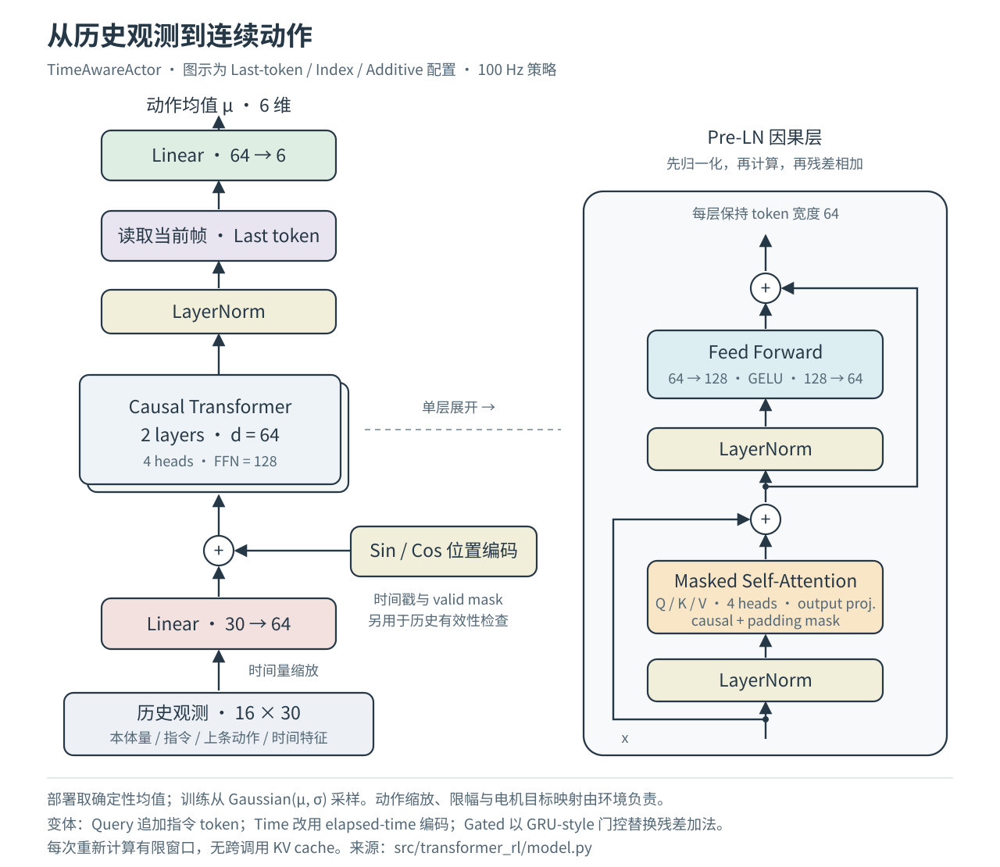
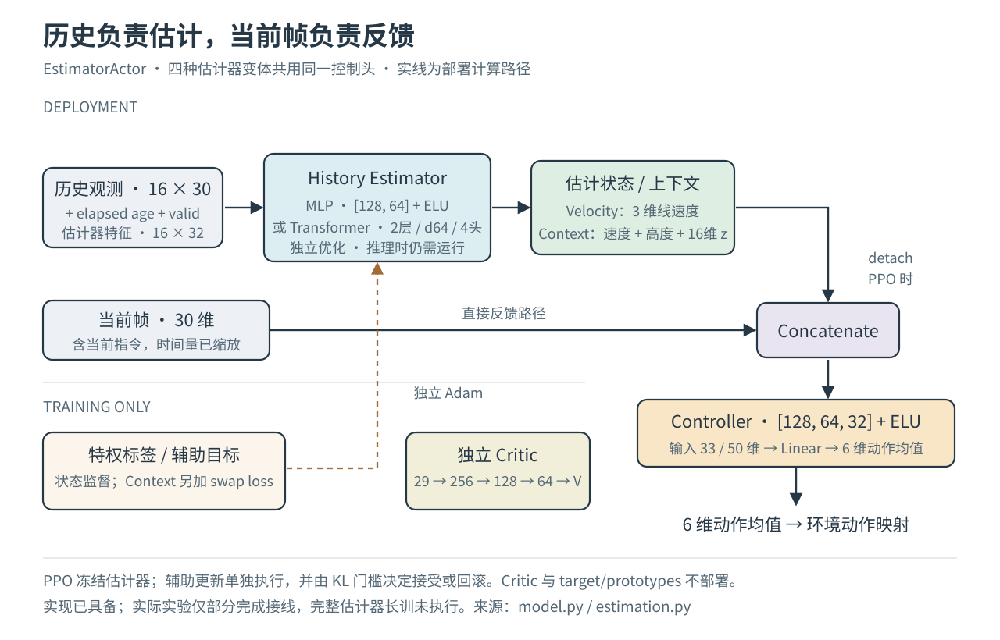
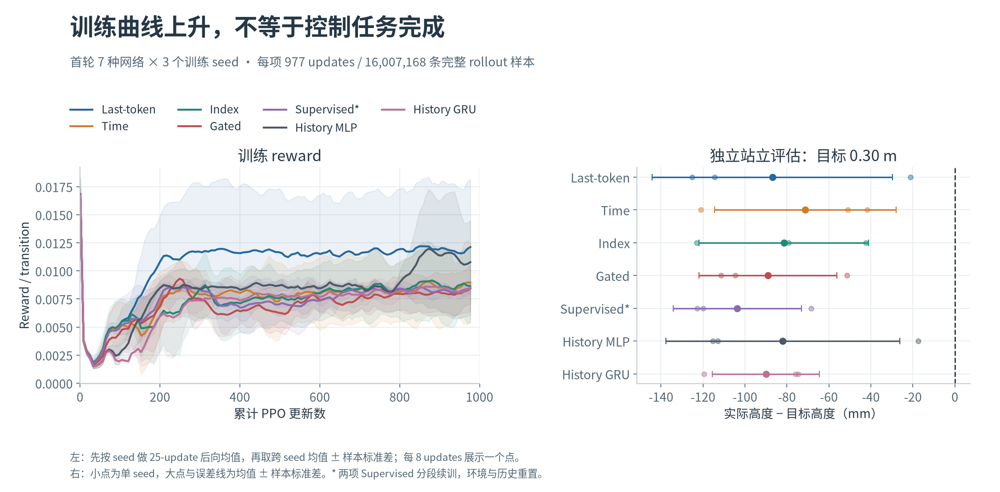
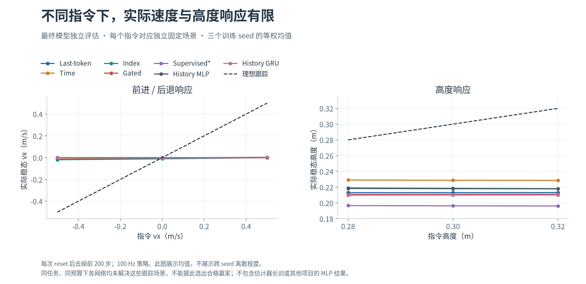
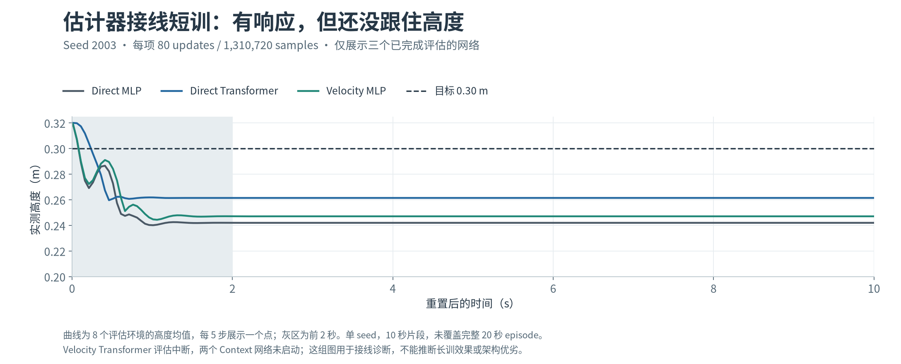

# transformer_rl

这个项目研究的是：**在机器人的控制任务里，什么形式的 Transformer 更合适？**

**本轮研究已于2026年9月19日收尾，Transformer训练已停止。** 当前实验没有显示出
足以支持工程替换的Transformer优势，低层实时控制优先采用短历史MLP／轻量估计器。
这是当前任务与实验预算下的选型决定；历史长度消融和完整估计器长训尚未完成。
结果、适用范围与代码索引见[研究结论与归档](docs/RESEARCH_CONCLUSION.md)。

我们关心的不只是机器人能不能动起来，还包括站立时会不会慢慢漂走、不同高度能不能保持、动作是否抖动，以及这些表现需要多少训练和推理开销。MLP 和 GRU 都是值得认真对待的对照，Transformer 是否有优势，要靠同条件下的结果说明。

代码使用 PyTorch，实现了自己的 PPO、历史管理和实验调度，没有依赖 RSL-RL。仿真通过环境接口接入；目前已在 Kaiser 的 Isaac Lab 环境跑通真实训练与评估。

**首轮七种网络、三个seed的训练已于2026年9月18日02:17（北京时间）全部完成并回收。** 共21个最终模型、147份场景评估，见[完成与回收记录](docs/KAISER_ARCHITECTURE_COMPLETE.md)。执行完成不代表控制效果合格，完整网络选型还需结合物理指标。

## 我们在比较什么

所有网络读取相同的本体观测、命令和动作历史。当前默认窗口是16帧，每帧30维，包含传感器数据年龄及实际采样间隔。

| 配置名 | 想回答的问题 |
|---|---|
| `last_token_attention` | 标准因果 Transformer，从最后一个当前帧读出动作，表现如何？ |
| `index_attention` | 在相同位置编码下，独立的命令 query 是否比最后一帧读出更好？ |
| `time_attention` | 用真实时间差编码历史，是否比只用帧位置更合适？ |
| `gated_attention` | 门控残差能否让优化和控制更稳定？ |
| `supervised_attention` | 加入显式状态估计监督，是否能改善时序表示？ |
| `history_mlp` | 同样的历史信息，普通 MLP 能做到什么程度？ |
| `history_gru` | 门控记忆是否已经够用，是否需要 attention？ |

Transformer默认使用64维、2层、4个注意力头。辅助监督单独分组，因为它增加了训练信息，不能把收益全算到结构上。网络尺寸和历史长度都在配置里，命名不绑定机器人型号或实验轮次。

## 网络架构

### 直接控制：历史观测 → 动作

下图对应实际实现的 Last-token 路径：16帧历史经过因果自注意力，读取当前帧表示，
输出6维连续动作均值。右侧展开一个 **Pre-LN** 层；Query、时间编码和门控残差变体在图下注明。



训练时使用高斯策略采样，部署时取确定性均值。动作缩放与电机目标映射由环境负责。
实现见 [`TimeAwareActor` 与 `_CausalBlock`](src/transformer_rl/model.py)。

### 估计器分离：历史估计 → 当前帧反馈

第二种结构让历史编码器估计速度或上下文，当前帧直接进入控制头。
估计器使用独立优化器，PPO 更新时冻结它；部署时仍需执行估计器。



图示架构已经实现；对应实验仅部分完成接线，**不是完整长训对照结果**。
实现见 [`EstimatorActor`](src/transformer_rl/model.py) 和[独立辅助优化](src/transformer_rl/estimation.py)。

## 怎么判断“更好”

先看任务是否完成，再看完成得是否平稳。

我们复查过已有 MLP 的原始轨迹：有一个高度的波动很小，但机器人每20秒仍会漂移约1米。另一个高度的速度曲线也很平滑，却在持续后退。**“不怎么抖”和“站在正确的位置、保持正确的高度”是两件事。**

因此评估会分开记录：

- 高度、速度和姿态的偏差；
- 静止漂移、异常接触及失败情况；
- 每个环境、每个回合去掉均值后的波动；
- 腿部目标、轮速目标和力矩在采样点之间的变化；
- 多个训练 seed 的差异、实际样本量和计算开销。

稳态统计固定去掉每次 reset 后的前200步，不把 reset 的跳变算作抖动，也不把不同回合的均值差混进去。采样频率为100 Hz时，这些结果只反映相应控制频段，不能当作下位机高频电流环的测量。

## 实验结果

### 训练趋势与独立站立评估

首轮每种网络使用3个训练seed，每项977次更新、约1600万条完整rollout样本。
训练reward有所上升，但最终模型在目标0.30m站立场景仍有明显高度偏差，跨seed差异也很大。



阴影和误差线表示**跨训练seed的样本标准差，不是置信区间**。两项Supervised运行分段续训，
恢复时环境与历史重置；统一配方也不代表每种网络都已独立调到最优。

### 指令与实际响应

下图的每个点来自独立固定指令场景。虚线表示理想跟踪；实际速度接近零，
高度也没有跟随目标充分变化。当前结果没有给出可用于工程替换的Transformer优势，
首轮MLP和GRU同样没有解决这些场景。



<details>
<summary>查看估计器接线短训的高度轨迹</summary>

每项仅80次更新，单训练seed。曲线是8个评估环境的均值；10秒片段未覆盖完整20秒episode，
不能据此判断长训性能。Velocity Transformer评估中断，两个Context任务未启动。



</details>

图表使用已核验的真实日志与评估数据。[汇总CSV、来源SHA与重绘方法](docs/figures/README.md)随仓库保存；
完整结论见[研究结论与归档](docs/RESEARCH_CONCLUSION.md)。

## 目前做到哪一步

多架构的训练、检查点恢复、ONNX导出、命名场景评估和批量汇总已经接通。Kaiser上完成了六种网络的短训试验，以及学习率、输出初始化和探索标准差的敏感性研究。

本轮采用的工作配方是 `learning_rate=3e-5`、`mean_init_scale=0.1`、`initial_std=0.2`。它让 Transformer 在三个新 seed 上都能充分使用优化预算，但短训的高度和接触表现还不好，不能据此选出赢家。

已完成首轮为 **7种网络 × 3个训练 seed**，每项累计977次更新，对应完整rollout预算 **16,007,168个样本**；两个分段续训任务另保留中断和采样计数。[估计器对照方案](docs/ESTIMATOR_TRAINING_PLAN.md)的六种网络已实现，主档部署参数均在10万以内。实际执行到接线阶段：三个任务完整完成，第四个训练完成但评估中断，两个context任务未启动。16M特权诊断、18项64M主对照及更长预算实验取消执行，计划和实现保留供复查。

机械模型本次只做了视觉随动修复。这些训练采用同一研究动力学，视觉组件数量不会自动变成新的物理自由度。模型和驱动仍有研究近似，本轮对照没有覆盖非零通信延迟或推扰，结果按这个范围解释。

## 快速开始

当前队列已停止，可用 `~/trainctl status estimator` 查看状态。
终端控制工具及恢复机制保留，使用方法见[训练启停控制](docs/TRAINING_CONTROL.md)；
本轮收尾不安排恢复训练。

需要 Python 3.11 或更新版本，建议使用独立环境：

```bash
python -m pip install -e '.[test,export]'
python -m transformer_rl inspect --config configs/control.json
python -m pytest -q
```

`inspect`只显示网络配置和参数量，不创建仿真环境。

先生成实验计划，可以检查将要运行哪些网络、seed和评估场景：

```bash
python -m transformer_rl.experiment_cli plan \
  --spec configs/learning_curves.json --root runs/comparison
```

通用配置中的`environment_factory`默认为`null`，需要先填写实际环境工厂和参数，再生成新计划。配置完成后运行：

```bash
python -m transformer_rl.experiment_cli run \
  --root runs/configured_comparison --max-parallel 2

python -m transformer_rl.experiment_cli summarize \
  --root runs/configured_comparison
```

每项实验有独立进程、优化器、检查点和日志。默认只对最终检查点执行完整场景评估，中间检查点用于恢复和后续分析。已有输出目录不会被覆盖。

## 接入自己的任务

环境实现 `VectorEnv` 接口，提供观测、reward、终止状态以及 reset 前的终态。网络只生成控制量；动作缩放、通信队列和底层控制器仍由环境或控制层负责。

`previous_issued_action`表示上一条已经发出的指令，不意味着电机已经执行。已知的数据年龄与未知延迟也分开编码。这样的区分是为了让训练和真实控制链路有清楚的对应关系。

`examples/isaaclab_task.py`是现有研究任务的接入示例，不是一个自动适配任意机器人资产的工具。Isaac SDK的进程生命周期由专用worker管理，使用方法在[Kaiser记录](docs/KAISER_EXPERIMENTS.md)中。

## 文档

- [研究结论、实时控制取舍与代码索引](docs/RESEARCH_CONCLUSION.md)
- [训练预算与网络选型计划](docs/TRAINING_EVALUATION_PLAN.md)
- [估计器与控制网络训练方案](docs/ESTIMATOR_TRAINING_PLAN.md) / [华南虎、复旦与Transformer设计复核](docs/TRANSFORMER_APPLICATIONS.md)
- [训练方法](docs/KAISER_ESTIMATOR_RUN.md)
- [本机与SSH训练启停控制](docs/TRAINING_CONTROL.md)
- [实验配置、并发和结果汇总](docs/EXPERIMENTS.md)
- [MLP稳态基线](docs/MLP_STEADY_STATE_BASELINE.md) / [稳定性统计口径](docs/STABILITY_METRICS.md)
- [优化敏感性复验](docs/KAISER_SENSITIVITY_RECHECK.md) / [浮点一致性问题](docs/BEHAVIOR_PRECISION.md)
- [检查点与ONNX导出](docs/EXPORT.md)
- [视觉修复审查](docs/CHASSIS_GEOMETRY_REVIEW.md)
