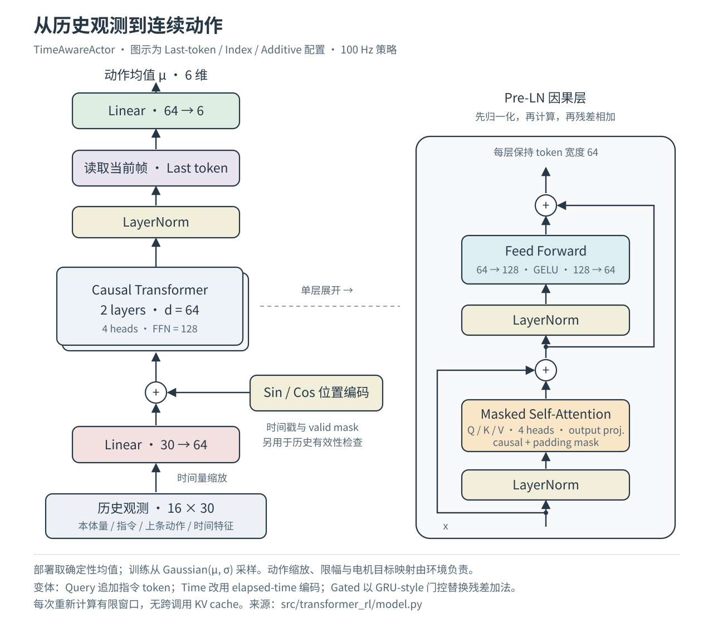
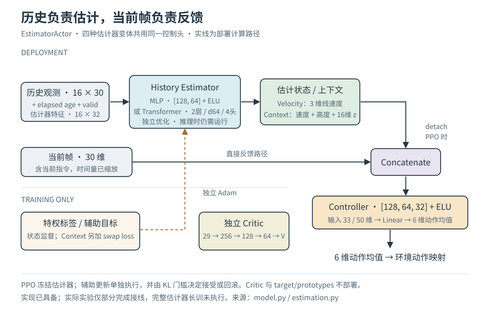

# transformer_rl

这个项目研究的是：**在机器人的控制任务里，什么形式的 Transformer 更合适？**

我们关心的不只是机器人能不能动起来，还包括站立时会不会慢慢漂走、不同高度能不能保持、动作是否抖动，以及这些表现需要多少训练和推理开销。MLP 和 GRU 都是值得认真对待的对照，Transformer 是否有优势，要靠同条件下的结果说明。

代码使用 PyTorch，实现了独立的 PPO、历史管理、检查点恢复、ONNX 导出与实验调度，没有依赖 RSL-RL。仿真通过环境接口接入，提供 Isaac Lab 接入示例。

[网络架构](#网络架构) · [使用方法](#使用方法) · [文档](#文档)

## 网络架构

针对当前35D无历史MLP，另有[原始观测Transformer结构与能力保持设计](docs/FRAME_POLICY_DESIGN.md)。
其中的独立 `FramePolicy` 保留35D特征语义，使用历史编码与当前帧直连；它提供CPU可验证的网络核心和对照配置，接入训练仍需显式适配，不能直接混用下述默认30D时间特征接口。

图文说明见[35D策略网络架构](docs/POLICY_ARCHITECTURE.md)和[网络结构比较与实验设计](docs/NETWORK_COMPARISON.md)。前者展开历史编码器、Actor、独立Critic与部署边界，附录记录V6的Reward及课程；后者区分信息量、参数容量、训练机制和实时成本。

### 对照结构

所有网络读取相同的本体观测、命令和动作历史。当前默认窗口是16帧，每帧30维，包含传感器数据年龄及实际采样间隔。

| 配置名 | 想回答的问题 |
|---|---|
| `last_token_attention` | 标准因果 Transformer，从最后一个当前帧读出动作，表现如何？ |
| `index_attention` | 在相同位置编码下，独立的命令 query 是否比最后一帧读出更好？ |
| `time_attention` | 用真实时间差编码历史，是否比只用帧位置更合适？ |
| `gated_attention` | 门控残差能否让优化和控制更稳定？ |
| `supervised_attention` | 加入显式状态估计监督，是否能改善时序表示？ |
| `history_mlp` | 同样的历史信息，普通 MLP 能做到什么程度？ |
| `history_gru` | 门控记忆是否已经够用，是否需要 attention？ |

Transformer默认使用64维、2层、4个注意力头。辅助监督单独分组，因为它增加了训练信息，不能把收益全算到结构上。网络尺寸和历史长度都在配置里，命名不绑定机器人型号或实验轮次。

### 直接控制：历史观测 → 动作

下图对应实际实现的 Last-token 路径：16帧历史经过因果自注意力，读取当前帧表示，
输出6维连续动作均值。右侧展开一个 **Pre-LN** 层；Query、时间编码和门控残差变体在图下注明。



训练时使用高斯策略采样，部署时取确定性均值。动作缩放与电机目标映射由环境负责。
实现见 [`TimeAwareActor` 与 `_CausalBlock`](src/transformer_rl/model.py)。

### 估计器分离：历史估计 → 当前帧反馈

第二种结构让历史编码器估计速度或上下文，当前帧直接进入控制头。
估计器使用独立优化器，PPO 更新时冻结它；部署时仍需执行估计器。



实现见 [`EstimatorActor`](src/transformer_rl/model.py) 和[独立辅助优化](src/transformer_rl/estimation.py)。

## 使用方法

### 安装与检查

需要 Python 3.11 或更新版本，建议使用独立环境：

```bash
python -m pip install -e '.[test,export]'
python -m transformer_rl inspect --config configs/control.json
python -m pytest -q
```

`inspect`只显示网络配置和参数量，不创建仿真环境。

### 配置与运行实验

实验规格定义网络变体、训练seed、预算和评估场景。通用配置中的
`environment_factory`默认为`null`，先填写实际环境工厂和参数，再生成计划：

```bash
python -m transformer_rl.experiment_cli plan \
  --spec configs/learning_curves.json --root runs/comparison
```

运行已生成的计划并汇总结果：

```bash
python -m transformer_rl.experiment_cli run \
  --root runs/comparison --max-parallel 2

python -m transformer_rl.experiment_cli summarize \
  --root runs/comparison
```

每项实验有独立进程、优化器、检查点和日志。默认只对最终检查点执行完整场景评估，中间检查点用于恢复和后续分析。已有输出目录不会被覆盖。

### 接入自己的任务

环境实现 `VectorEnv` 接口，提供观测、reward、终止状态以及 reset 前的终态。网络只生成控制量；动作缩放、通信队列和底层控制器仍由环境或控制层负责。

`previous_issued_action`表示上一条已经发出的指令，不意味着电机已经执行。已知的数据年龄与未知延迟也分开编码。这样的区分是为了让训练和真实控制链路有清楚的对应关系。

[`examples/isaaclab_task.py`](examples/isaaclab_task.py)提供 Isaac Lab 接入示例，SDK进程生命周期由专用worker管理。
配置与运行细节见[实验使用说明](docs/EXPERIMENTS.md)、[训练方法](docs/KAISER_ESTIMATOR_RUN.md)和[训练控制工具](docs/TRAINING_CONTROL.md)。

## 文档

- [研究结论、实时控制取舍与代码索引](docs/RESEARCH_CONCLUSION.md)
- [训练预算与网络选型计划](docs/TRAINING_EVALUATION_PLAN.md)
- [估计器与控制网络训练方案](docs/ESTIMATOR_TRAINING_PLAN.md) / [华南虎、复旦与Transformer设计复核](docs/TRANSFORMER_APPLICATIONS.md)
- [训练方法](docs/KAISER_ESTIMATOR_RUN.md)
- [本机与SSH训练启停控制](docs/TRAINING_CONTROL.md)
- [实验配置、并发和结果汇总](docs/EXPERIMENTS.md)
- [MLP稳态基线](docs/MLP_STEADY_STATE_BASELINE.md) / [稳定性统计口径](docs/STABILITY_METRICS.md)
- [优化敏感性复验](docs/KAISER_SENSITIVITY_RECHECK.md) / [浮点一致性问题](docs/BEHAVIOR_PRECISION.md)
- [检查点与ONNX导出](docs/EXPORT.md)
- [视觉修复审查](docs/CHASSIS_GEOMETRY_REVIEW.md)
