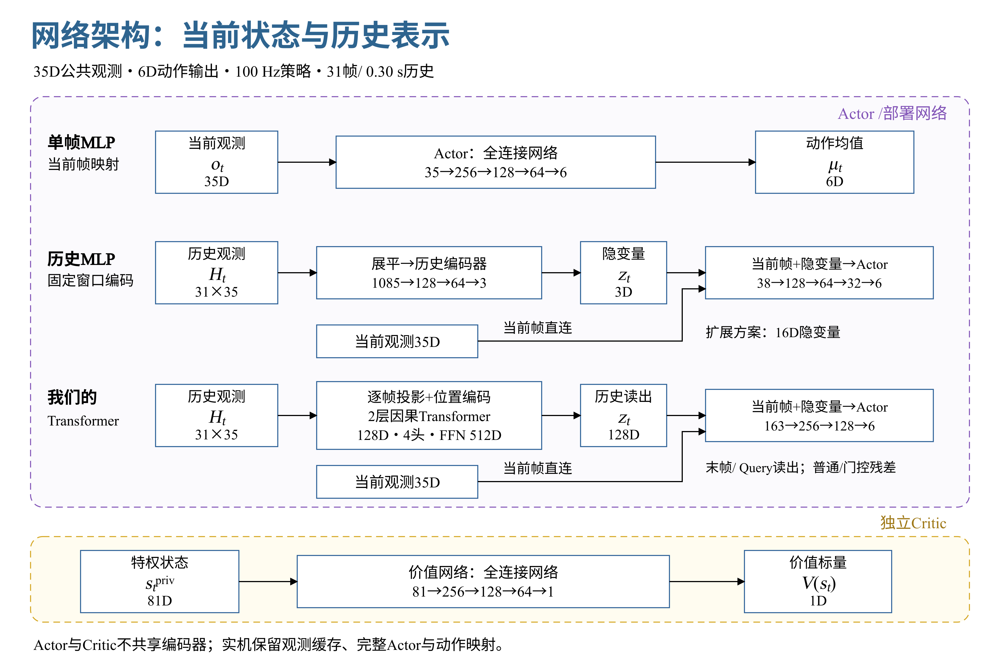
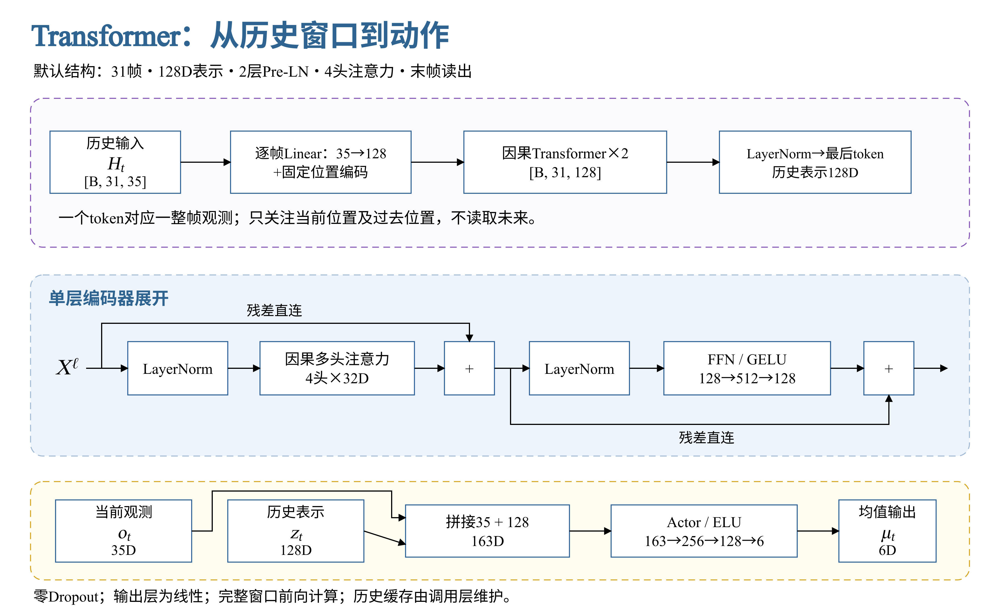
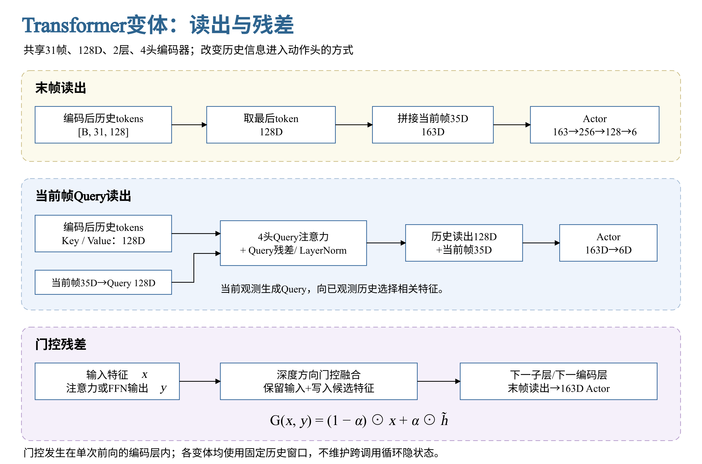
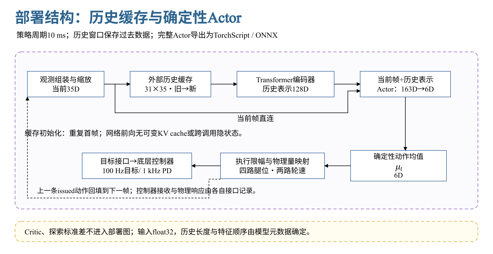

# 面向实时控制的策略网络架构

## 1 观测与总体架构

策略将公共观测映射为六维动作均值。单帧 MLP 直接读取当前观测；历史 MLP 和 Transformer 先将最近的观测编码为隐变量，再与当前观测拼接进入动作头。当前帧直连保留即时状态和命令，历史分支提供动态上下文。Actor 与 Critic 使用独立参数，部署包含完整 Actor、外部历史缓存和动作映射。

图 1：三类 Actor 的数据路径与层宽。紫色虚线框为部署 Actor，黄色虚线框为独立价值网络；历史 MLP 与 Transformer 均保留当前帧直连。

每帧公共观测为 35D，各组按固定顺序拼接。这里的上一动作指上一条经过执行限幅的 issued 动作，表示策略此前给出的命令。

$$
o_t=[c_t^{(4)},\omega_t^{(3)},g_t^{(3)},\Delta q_t^{(6)},\dot q_t^{(6)},\bar u_{t-1}^{(6)},m_t^{(7)}]\in\mathbb R^{35}.
$$

| 槽位（从 0 开始） | 输入组 | 维数与缩放 |
|---|---|---|
| 0–3 | 前向、侧向、yaw 与高度命令 | 4D；高度 ×5 |
| 4–6 | 机体角速度 | 3D；×0.5 |
| 7–9 | 机体系投影重力 | 3D |
| 10–15 | 六轴相对关节位置 | 6D；两个轮位置槽置 0 |
| 16–21 | 六轴关节速度 | 6D；×0.1 |
| 22–27 | 上一条 issued 动作 | 6D；按策略轴序 |
| 28–34 | 模式、请求高度与命令时钟 | 7D；五个模式槽、请求高度 ×5、命令时钟（秒） |

历史窗口由旧到新排列，当前帧位于最后一行。策略频率为 100 Hz，历史网络使用 31 帧，首尾跨度为 0.30 秒；单帧 MLP 使用一帧。

$$
H_t=[o_{t-30},\ldots,o_t]\in\mathbb R^{31\times35},\qquad T_{\mathrm{span}}=(31-1)\times0.01\,\mathrm{s}=0.30\,\mathrm{s}.
$$

历史表示可以承载速度变化、动作响应和接触变化等线索。单帧容量主要决定当前状态映射的复杂度；历史编码同时增加可使用的时间信息。隐变量由策略目标共同学习，其坐标没有预先规定的物理含义。

## 2 两类 MLP 策略

**单帧 MLP。** 当前 35D 观测依次通过三个全连接隐藏层，ELU 激活后由线性层输出六维均值。标准层宽为 256、128、64；较大版本为 512、256、128。该结构没有额外历史编码器，上一动作和命令上下文仍属于当前帧输入。

$$
\mu_t=\mathrm{MLP}_{35\to256\to128\to64\to6}(o_t).
$$

**历史 MLP。** 历史窗口先展平，再通过 MLP 压缩为低维隐变量；动作头同时读取该隐变量和未经历史压缩的当前观测。小瓶颈版本输出 3D，动作头输入为 35+3=38D；扩展版本输出 16D，动作头输入为 51D。

$$
z_t=\mathrm{MLP}_{1085\to128\to64\to3}(\mathrm{vec}(H_t)),\qquad \mu_t=\mathrm{MLP}_{38\to128\to64\to32\to6}([o_t,z_t]).
$$

$$
z_t^{\mathrm{wide}}=\mathrm{MLP}_{1085\to256\to128\to64\to16}(\mathrm{vec}(H_t)),\qquad \mu_t=\mathrm{MLP}_{51\to256\to128\to64\to6}([o_t,z_t^{\mathrm{wide}}]).
$$

3D 或 16D 是表示容量，不等同于机体速度。历史 MLP 对时间槽使用不同的首层权重，首层规模随窗口长度增长；Transformer 在各时间位置共享逐帧投影与编码权重，并利用注意力组合不同时间的信息。

## 3 Transformer 历史编码与动作头

默认网络将 31 个观测帧分别映射到 128D，加入固定位置编码，再经过两层因果 Pre-LN Transformer。每层使用四头注意力，每头 32D；前馈网络为 128→512→128，激活为 GELU。末端 LayerNorm 后得到历史 token 序列，读出 128D 隐变量，与当前 35D 拼接为 163D，进入 256→128→6 的 ELU 动作头。

图 2：默认 Transformer 的逐层尺寸与单层展开。注意力子层和前馈子层均先归一化再计算，并保留残差直连。

### 3.1 逐帧投影与位置编码

一个 token 对应一整帧 35D 观测。1085 是窗口内的标量总数，投影后仍保留 31 个时间位置。用 B 表示 batch 大小，d 表示 token 宽度，默认 d=128。

$$
X^0=H_tW_e^\top+\mathbf1b_e^\top+P,\qquad X^0\in\mathbb R^{B\times31\times128}.
$$

位置编码使用窗口内的索引 p=0,…,30。实现将所有正弦通道与所有余弦通道分别排列后拼接；位置编码是固定缓冲，不增加可学习参数。

$$
\nu_i=10000^{-2i/d},\qquad P_p=[\sin(p\nu_0),\ldots,\sin(p\nu_{d/2-1}),\cos(p\nu_0),\ldots,\cos(p\nu_{d/2-1})].
$$

### 3.2 因果注意力与 Pre-LN 编码

每个时间位置只读取自身与更早的 token。最后一个位置可以关注完整历史窗口。不同头各自计算关联权重，将历史中的相关信息汇聚为当前层表示。

$$
\mathrm{Attn}(Q,K,V)=\mathrm{softmax}\!\left(\frac{QK^\top}{\sqrt{d_h}}+M\right)V,\qquad M_{ij}=\begin{cases}0,&j\le i\\-\infty,&j>i.\end{cases}
$$

$$
U^\ell=X^\ell+\mathrm{MHA}_{\mathrm{causal}}(\mathrm{LN}(X^\ell)),\qquad X^{\ell+1}=U^\ell+\mathrm{FFN}(\mathrm{LN}(U^\ell)).
$$

$$
\mathrm{FFN}(x)=W_2\,\mathrm{GELU}(W_1x+b_1)+b_2.
$$

默认结构使用零 Dropout。两层编码器的结构相同、参数独立；每次前向计算完整窗口。Pre-LN 和残差直连为层间信息与梯度提供直接通路。

### 3.3 末帧读出与当前帧 Query 读出

**末帧读出。** 取归一化后最后一个 token 作为隐变量。该 token 已通过因果注意力读取过去帧，随后与当前观测拼接。网络输出线性动作均值，执行限幅放在网络外。

$$
Z=\mathrm{LN}(X^2),\qquad z_t=Z_{30},\qquad\mu_t=\mathrm{MLP}_{163\to256\to128\to6}([o_t,z_t]).
$$

**当前帧 Query 读出。** 用当前完整 35D 观测生成 Query，编码后的 31 个 token 生成 Key 与 Value，额外进行一次多头注意力汇聚。当前帧同时保留直接进入动作头的通路，读出维度仍为 128D。

$$
q_t=W_qo_t+b_q,\qquad K=ZW_k^\top+\mathbf1b_k^\top,\qquad V=ZW_v^\top+\mathbf1b_v^\top,
$$

$$
z_t=\mathrm{LN}\!\left(q_t+W_o\,\mathrm{MHA}(q_t,K,V)+b_o\right),\qquad \mu_t=\mathrm{MLP}_{163\to256\to128\to6}([o_t,z_t]).
$$

这里的 MHA 表示各头加权结果的拼接，W_o 是读出模块的唯一输出投影。Query 只汇聚截至当前时刻已经观测到的窗口。它将历史检索显式条件化于当前状态和命令，改变的是读出方式。

图 3：三种 Transformer 结构变化。末帧与 Query 改变历史读出；门控残差改变编码层内部的特征融合。

### 3.4 门控残差

门控版本在注意力与 FFN 两个子层中，用可学习门替代直接相加。对输入特征 x 与子层输出 y，门决定保留多少输入、写入多少候选特征。

$$
r=\sigma(W_rx+U_ry+b_r),\qquad \alpha=\sigma(W_\alpha x+U_\alpha y+b_\alpha),
$$

$$
\tilde h=\tanh(U_hy+W_h(r\odot x)+b_h),\qquad G(x,y)=(1-\alpha)\odot x+\alpha\odot\tilde h.
$$

$$
U^\ell=G_{\mathrm{attn}}(X^\ell,\mathrm{MHA}_{\mathrm{causal}}(\mathrm{LN}(X^\ell))),\qquad X^{\ell+1}=G_{\mathrm{ffn}}(U^\ell,\mathrm{FFN}(\mathrm{LN}(U^\ell))).
$$

更新门偏置初始化为 −2，使初始融合倾向保留输入。门控沿编码深度发生在单次前向中，各次调用仍只依赖显式历史窗口。该设计借鉴 GTrXL 的残差门控思路，使用固定窗口编码器。

## 4 非对称 Actor-Critic

Actor 读取可用于控制的公共观测，Critic 读取更完整的 81D 状态。两者没有共享编码器或共享隐藏层。公共观测与特权状态的区分使部署 Actor 的输入保持为 35D，而价值网络可以利用真实运动与接触信息。

$$
s_t^{\mathrm{priv}}=[\tilde o_t^{(35)},v_t^{(3)},h_t^{(1)},f_{\mathrm{wheel},t}^{(2)},q_{\mathrm{mech},t}^{(18)},\dot q_{\mathrm{mech},t}^{(18)},\mu_{\mathrm{contact},t}^{(2)},h_{\mathrm{terrain},t}^{(2)}]\in\mathbb R^{81}.
$$

Critic 使用 81→256→128→64→1 的独立 MLP，隐藏层为 ELU，输出是一个价值标量。干净公共观测为 35D，其余特权信息共 46D。

$$
V_\phi(s_t^{\mathrm{priv}})=\mathrm{MLP}_{81\to256\to128\to64\to1}(s_t^{\mathrm{priv}}).
$$

策略分布由 Actor 均值和六个状态无关的探索标准差参数构成。确定性部署只使用均值网络，Critic 与探索标准差均不进入导出图。

$$
u_t^{\mathrm{raw}}\sim\mathcal N(\mu_t,\mathrm{diag}(\sigma^2)),\qquad u_t^{\mathrm{deploy}}=\mu_t.
$$

## 5 100 Hz 部署结构

完整策略由观测组装、历史缓存、编码器、动作头和动作映射组成。Transformer 的编码器与动作头作为一个 Actor 导出，调用层维护由旧到新的 31×35 历史。初始化或重置时重复首帧填满窗口，每个策略周期加入一帧；网络自身没有跨调用隐状态或可变 KV cache。

图 4：观测到控制目标的部署数据流。当前帧直连与历史分支在动作头汇合，上一条 issued 动作回填到下一帧公共观测。

策略每 10 ms 生成一次目标，底层控制器以 1 kHz 运行 PD。0.30 秒是保存的过去跨度，历史缓存无需等待未来帧。当前帧直连保留即时输入，同时与历史分支一起完成本次 Actor 前向。

六维输出按四个腿关节和两个轮排列。网络输出保持线性，执行层分别限幅后映射为关节位置目标与轮速目标。

$$
\bar u_t^{\mathrm{leg}}=\mathrm{clip}(\mu_t^{\mathrm{leg}},-3,3),\qquad q_t^{\mathrm{target}}=q^{\mathrm{nominal}}+0.25\bar u_t^{\mathrm{leg}},
$$

$$
\bar u_t^{\mathrm{wheel}}=\mathrm{clip}(\mu_t^{\mathrm{wheel}},-9,9),\qquad\dot q_t^{\mathrm{target}}=10\bar u_t^{\mathrm{wheel}}.
$$

部署模型支持 TorchScript 与 ONNX，输入为 float32 的 [B,L,35]，输出为 [B,6]。模型元数据保存特征顺序、轴序、缩放、历史长度、策略周期和目标映射。上一条 issued 动作、控制器收到的目标和实际电机响应属于不同接口信号，观测缓存回填的是第一项。

## 6 网络变体与容量

结构变化分为历史编码、读出方式、残差融合和容量四个维度。末帧、Query 与门控三个默认宽度变体使用相同的 31 帧、128D、2 层、4 头与 163→256→128→6 动作头。小型与大型版本通过 token 宽度、编码层数和 FFN 宽度调整容量。

| 配置 | 历史编码 / 读出 | Actor 动作头 | 均值网络参数 |
|---|---|---|---:|
| mlp | 单帧；无历史编码 | 35→256→128→64→6 | 50,758 |
| mlp_medium | 单帧；无历史编码 | 35→512→256→128→6 | 183,430 |
| history_mlp | 1085→128→64→3 | 38→128→64→32→6 | 162,985 |
| history_mlp_wide | 1085→256→128→64→16 | 51→256→128→64→6 | 375,062 |
| transformer_small | 96D；2层；4头；FFN192；末帧 | 131→128→64→6 | 178,758 |
| transformer | 128D；2层；4头；FFN512；末帧 | 163→256→128→6 | 477,062 |
| transformer_query | 128D；2层；4头；FFN512；Query | 163→256→128→6 | 531,462 |
| transformer_gated | 128D；2层；4头；FFN512；门控残差＋末帧 | 163→256→128→6 | 871,814 |
| transformer_large | 160D；3层；5头；FFN640；末帧 | 195→256→128→6 | 1,017,766 |
| transformer_xlarge | 192D；4层；6头；FFN1024；末帧 | 227→256→128→6 | 2,273,030 |

上表仅统计确定性 Actor 均值网络，包含历史编码器、读出模块与动作头；探索标准差另有 6 个参数，独立 Critic 为 62,209 个参数。历史网络均使用 31 帧。门控增加两个子层的融合矩阵，Query 增加读出投影与归一化，容量增长来源各不相同。

Transformer 的参数在时间位置之间共享，编码器主要权重规模为 O(N(d²+df))；完整窗口前向主要计算规模为 O(N(Ld²+Ldf+L²d))。参数量表示模型容量，计算量还取决于窗口长度 L、层数 N、表示宽度 d 与 FFN 宽度 f。

## 7 实现与原理参考

网络结构对应 [frame_policy.py](https://github.com/Yukikaze2233/transformer_rl/blob/main/src/transformer_rl/frame_policy.py)；独立 Actor-Critic 对应 [frame_training.py](https://github.com/Yukikaze2233/transformer_rl/blob/main/src/transformer_rl/frame_training.py)；十种配置定义在 [chassis_adapter.py](https://github.com/Yukikaze2233/transformer_rl/blob/main/src/transformer_rl/chassis_adapter.py)；部署导出与运行接口对应 [frame_export.py](https://github.com/Yukikaze2233/transformer_rl/blob/main/src/transformer_rl/frame_export.py) 和 [frame_runtime.py](https://github.com/Yukikaze2233/transformer_rl/blob/main/src/transformer_rl/frame_runtime.py)。

注意力的基本形式参见 [Attention Is All You Need](https://arxiv.org/abs/1706.03762)；残差门控思路参见 [Stabilizing Transformers for Reinforcement Learning](https://proceedings.mlr.press/v119/parisotto20a.html)。更广泛的结构特点见[配套网络比较文档](https://fa4g5no1b1f.feishu.cn/wiki/XubFwKGT0iJ7wFk3t7ocqg5tnFf)。
