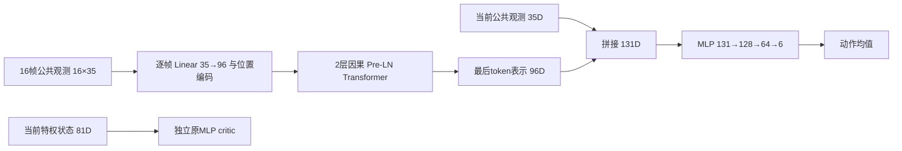

# 从当前 V6 MLP 到历史 Transformer

2026-09-29。本文对照正在运行的新资产 V6，区分网络结构、历史信息和能力保持。新网络核心已实现并做CPU合成验证；生产适配、保持损失和机器人对照训练尚未完成。本次不替换 Kaiser 运行中的合同或源码。

## 1. 当前普通 MLP 的实际实现

运行冻结源码为 `1f9a884368e772741c269567a1b4b3c21f371349`，合同为相邻仓库的 `contracts/v6_new_asset_training_v1.json`。`train_chassis.py` 经 Isaac Lab 配置适配器构造 RSL-RL 5.5.1 的独立 actor/critic：

```text
公共观测35D → Linear256 → ELU → Linear128 → ELU → Linear64 → ELU → Linear6
特权状态81D → Linear256 → ELU → Linear128 → ELU → Linear64 → ELU → Linear1
```

Actor 最后一层为未限幅的动作均值。训练采样
\(a_t^{raw}\sim\mathcal N(\mu_\theta(o_t),\operatorname{diag}(\sigma^2))\)，评测取均值。六轴各有一个状态无关的可学习σ，当前初始化为1.0；配置类里旧默认0.2会被合同覆盖。`scalar`不表示六轴共用一个数。

\[
P_{actor}=(35+1)256+(256+1)128+(128+1)64+(64+1)6=50,758.
\]

加探索参数后为50,764，critic为62,209，总训练参数112,973。Actor和critic没有共享特征网络。

这与华南虎**普通 WheelbipeV14FlatPPORunnerCfg**的单帧、`[256,128,64]`、ELU、初始σ1.0同型；不能泛指其DreamWaQ/HIM等所有变体。[SCUT固定版本网络配置](https://github.com/scutrobotlab/wheeled-legged_RL/blob/b8ff79f3df855faf9dc92f4a282bd80c42649466/source/agent_tasks/agent_tasks/direct/wheelbipe/agents/rsl_rl_ppo_cfg.py)

我方81D critic、人工请求语义、1kHz物理/PD、奖励、采样和课程均有独立合同。SCUT普通V14的特权观测与物理频率不同，网络同型不等于整个任务相同。[SCUT V14环境配置](https://github.com/scutrobotlab/wheeled-legged_RL/blob/b8ff79f3df855faf9dc92f4a282bd80c42649466/source/agent_tasks/agent_tasks/direct/wheelbipe/wheelbipe_V14/env_cfg.py)

### 35D已经包含哪些信息

来自当前 `scut_observation.py::build_manual35`，索引从0开始：

|槽位|含义|
|---|---|
|0–2 / 3|vx、vy、yaw角速度命令 / 高度命令×5|
|4–6 / 7–9|IMU角速度×0.5 / 投影重力|
|10–15|相对电机角度，wrap到±π；两个轮位置槽置零|
|16–21|六轴电机速度×0.1|
|22–27|上一条经过控制器限幅的动作，按policy轴序|
|28 / 29 / 30 / 31 / 32|normal / stair / 保留slope / stair恢复 / jump请求|
|33 / 34|请求幅值相关高度×5 / 0–5s命令参考时钟|

“无历史帧”是没有显式观测窗口，仍有上一动作和命令时钟。上一动作是发出的指令，不等于实际执行力矩。Actor不读取真实机体线速度、真实高度、接触力或地形真值。

PPO保存未裁剪动作及其log-prob；执行层再将腿/轮限到±3/±9，腿目标为nominal+0.25a，轮目标为10a。策略50Hz，物理/PD反馈1000Hz；每个策略周期20次反馈控制。这些处理保持在网络之外。

## 2. 当前回退证据不能被网络假设覆盖

北京时间10:09只读快照：S1为320/1000更新、1.536亿转移，正在固定评测。320的评测当时尚未完成。以下来自同一训练seed的完整固定用例：

|更新|主评测seed通过/16|305mm高度MAE|最大站立漂移|前进0.5m/s速度MAE|
|---:|---:|---:|---:|---:|
|200|6|2.095mm|5.366cm|0.0564m/s|
|240|3|0.855mm|45.393cm|0.0196m/s|
|280|5|1.685mm|15.125cm|0.0153m/s|

第二评测seed通过数为6/3/4，漂移趋势相符；两个评测seed不是两个训练seed。高度持续达标，前进跟踪改善，静止漂移回退，说明能力取舍/训练不稳定确实存在。尚未进入S2–S6，不能据此宣称已经发生跨技能灾难性遗忘或容量不足。

两个重要混杂：

- 第200个actor更新后，相关高度采样路径从80%固定九档+20%连续变为50%固定+50%连续。通过固定分支抽到指定一档的概率由0.8/9变为0.5/9，下降37.5%；给定已进入固定分支，各档概率仍为1/9。这不是所有训练样本下降37.5%，时间相邻也不足以证明因果。
- LR使用adaptive。200/240块末LR为8.779e-4，280为3.902e-4，320为2.601e-4；不能把初始1e-4当实际恒定值，也不能把块末值当期间峰值。

读取时间、原始来源和SHA见相邻工作区的[只读审计报告](../../robot_rl/isaac_wheeled_rl_train/reports/transformer_retention_design_20260929/SUMMARY.md)。原始运行数据不纳入本仓库提交。

当前已有旧技能复习配额、累计保护账本和有界回滚。评测门控能阻止退化策略晋级，却不能直接阻止每次梯度更新伤害旧能力。

## 3. 推荐结构：当前帧直连＋历史Transformer＋共同动作头

每个token是一整帧35D，不是把同一帧35个数当35个时间token：



\[
H_t=[o_{t-15},\ldots,o_t],\quad x_i=W_eo_i+b_e+p_i,
\]
\[
U^\ell=X^\ell+\operatorname{MHA}(\operatorname{LN}(X^\ell)),\quad
X^{\ell+1}=U^\ell+\operatorname{FFN}(\operatorname{LN}(U^\ell)),
\]
\[
z_t=\operatorname{LN}(X^2)_t,\quad
\mu_t=\operatorname{MLP}_{131\to128\to64\to6}([o_t,z_t]).
\]

4头、head_dim24、FFN96→192→96；FFN用GELU，动作头用ELU。固定位置编码、因果mask、零dropout、无跨调用KV缓存。最后token读取全部过去帧，早期token不能看未来。

|项目|当前MLP|第一版Transformer|
|---|---|---|
|每帧信息|公共35D|相同公共35D|
|输入|1×35|16×35，首尾跨度0.30s|
|当前状态通路|直接入MLP|当前35D直接进入融合动作头|
|动作均值参数|50,758|178,758|
|加6个探索参数|50,764|178,764|
|Critic|独立81→256→128→64→1|首轮相同|
|完整前向主要MAC|50,304|约2,536,704|

MAC仅计主要乘加，不含激活、归一化和访存，不是时延实测。参数约3.52倍，但16帧重算使主要MAC约50.4倍；不能根据参数量猜吞吐。

当前帧直连提供即时姿态、编码器和命令，历史通路学习升降方向、制动趋势、执行迟滞与滑移迹象。它增加可用信息，但不能保证唯一恢复真实状态。无外部位置、轮位置槽置零时，0.30s历史也不能凭空保证10s绝对位置不漂移，更不能代替请求和落地完成状态机。

第一版不冻结尚未整体验收的MLP，也不默认加入四技能head。冻结弱teacher容易保留错误行为；多头仍可能通过共享Transformer发生干扰。基础对照后，若记录到长期梯度冲突，再比较请求条件adapter。只冻head不保护共享表示；完整冻结分支保持的是该分支函数，仍须闭环验收。[Progressive Neural Networks](https://arxiv.org/abs/1606.04671)

## 4. 能力保持是独立训练机制

历史编码\(z_t=E(H_t)\)解决当前episode的信息问题；旧任务回报\(J_j(\theta_{k+1})<J_j(\theta_k)\)属于更新后的能力退化。若最小化新任务损失，\(\theta'=\theta-\eta g_{new}\)，则

\[
\Delta L_{old}\approx-\eta g_{old}^{\top}g_{new}.
\]

负梯度内积会增加旧损失；attention本身不约束该内积。PPO clipping只针对当前rollout采样分布，并不保证所有旧技能回报不下降。[PPO原论文](https://arxiv.org/abs/1707.06347)

建议在独立对照中加入：

1. **分层fresh复习。** 在已有行为池内保证不同站高、静止、正反速度、起停和技能恢复的覆盖，使用当前策略重新采样。记录有效transition和回合占比。固定200前后高度混合、LR上限等诊断必须与架构臂分开，不能同时改后把收益全归网络。
2. **已验收区域teacher约束。** 保存不可变合格checkpoint及其适用区，对独立训练锚点约束行为。未通过的停车/后退不能作为强制模仿目标；一个case通过也不代表所有状态都可靠。不同teacher区域重叠时先解决归属/冲突。[Policy Distillation](https://arxiv.org/abs/1511.06295)

候选损失：

\[
L=L_{PPO}+c_VL_V-c_H\mathcal H+\lambda_{keep}
\mathbb E_{H\sim B_{anchor}\cup D_{old,fresh}}
q(H)D_{KL}(\pi^*(\cdot|H)\Vert\pi_\theta(\cdot|H)).
\]

\(q\)仅是teacher适用权重，不作为actor输入。旧MLP teacher取同一历史的末帧，新学生取完整窗口。对角高斯KL为

\[
\sum_a\left[\log\frac{\sigma_{\theta,a}}{\sigma^*_a}
+\frac{(\sigma^*_a)^2+(\mu^*_a-\mu_{\theta,a})^2}{2\sigma_{\theta,a}^2}-\frac12\right].
\]

比较原始策略域，不用已裁剪动作代替概率分布。记录均值与方差两部分；也可消融按六轴动作尺度归一的均值损失，探索方差独立处理。

锚点来自训练场景/独立随机种子，不能用最终留出评测轨迹训练。旧历史和teacher输出可做监督损失；旧动作、GAE、value target不能直接当作当前PPO样本。保持损失应计入同一受监控的actor更新及KL，不能在PPO之后再无约束改actor。Critic学习fresh旧场景的当前return，不强行复制旧策略/旧奖励下的value。

这些机制仍不保证闭环不遗忘。继续逐能力验收，报告相对固定已验收参考的误差变化、丢失通过项及多训练seed差异。TensorBoard建议增加 `Retention/<family>/reference_delta`、`Policy/<family>/teacher_kl`、`Sampling/<family>/transition_fraction`，明确消费更新/样本横轴，回滚不返还预算。

## 5. 有控制变量的对照顺序

|轮次|对照|区分的因素|
|---|---|---|
|A|50.8k原MLP / 183.4k单帧MLP|容量|
|B|183.4k单帧MLP / 185.2k堆帧MLP / 178.8k Transformer|历史与attention|
|C|MLP和Transformer分别启用/关闭同一保持机制|结构与保持训练|
|D|小档 / 431.0k Transformer；普通 / GRU门控残差|扩容与优化结构|
|E|单头 / 请求条件adapter或多头|实测仍有干扰时再增加复杂度|

主要比较至少3个独立训练seed，固定新资产、奖励、控制频率、初始σ、总转移数和固定评测合同。网络调参预算也需记录；现有adaptive LR的实际轨迹不能省略。若更换采样/学习率配方，所有架构使用同一新配方，并单列相对当前运行的差异。

同时报告高度误差、漂移、停车峰值和平均残速、前后速度、动作变化、跌倒、饱和与吞吐。不能只比总reward或通过数量。S5训练辅助窗口与无辅助评测必须相同处理。

16帧在50Hz跨0.30s；未来单独研究100Hz时，要31帧保持跨度，并统一折扣、GAE、奖励和rollout物理时长。当前新奖励的死亡200已经是一次性事件，不沿用旧版200×dt假设。

100Hz把策略指令保持时间从20ms缩到10ms，可能改善快速扰动、起停和落地后的响应，但不会提高已经为1kHz的PD反馈频率。价值要看传感器更新、执行迟滞以及端到端推理/通信是否能满足10ms周期；先测时延分位数和deadline miss，再比较行为指标。保持连续时间折扣时，\(\gamma(\Delta t)=e^{-\beta\Delta t}\)，因此\(\gamma_{100}=\sqrt{\gamma_{50}}\)；若也保持GAE的\((\gamma\lambda)\)物理衰减时间，则\(\lambda_{100}=\sqrt{\lambda_{50}}\)。24步rollout改48步才保持0.48s，但转移数随之翻倍，必须同时报告物理时间、样本数和优化步数。按时间积分的奖励要核对dt，一次性事件罚分保持事件口径。该频率实验排在50Hz架构对照之后。

## 6. 本轮代码与使用

新增 [`frame_policy.py`](../src/transformer_rl/frame_policy.py) 的 `FramePolicyConfig` / `FramePolicy`，支持单帧MLP、堆帧MLP、当前帧直连Transformer。复用原 `_CausalBlock`，不引入RSL依赖。

- `forward`输入`[B,L,F]`，`forward_flat`输入`[B,L*F]`，输出仅确定性动作均值。
- 特征已按任务合同缩放，模块不再缩放、不新增真值、不追加重复的上一动作。
- 完整窗口按旧到新排列；V6比较由调用方实现reset重复首帧、同tick不重复推进、独立rollout快照。
- 模块不管理Gaussian、critic、优化器、历史缓存或执行限幅；这些是接入层职责。

原有默认30D time-aware接口含sensor ages、age-known flags及policy interval，不能通过修改`proprio_dim`凑成35D。原 `ModelConfig`、五输入模型、runner和checkpoint schema保持原语义；新增配置**不适用于旧`transformer-rl inspect/train/export`入口**。

```bash
PYTHONPATH=src python tools/inspect_frame_policy.py \
  --config configs/frame_policies/transformer.json
PYTHONPATH=src python tools/inspect_frame_policy.py \
  --config configs/frame_policies/mlp.json
python -m pytest -q tests/test_frame_policy.py
```

`transformer_gated`复用本仓库的GRU式深度残差门，参数多于普通残差，没有Transformer-XL跨片段缓存。它不同于相邻训练仓库先前的逐通道残差缩放；门控优化稳定性也不是能力保持证明。[GTrXL原论文](https://proceedings.mlr.press/v119/parisotto20a.html)

生产接入前仍需：RSL薄适配层和完整checkpoint身份、独立研究合同/预检、保持损失与分层采样、显存和时延测试。首轮机器人对照保留现有RSL训练器，仅替换均值网络，避免把独立PPO实现差异混入结构比较。

仅20,000×24×560个float32历史数值约1.00GiB；48,000样本的Transformer minibatch还需要QKV、attention和反向激活。若用microbatch累积，必须按样本数加权，在完整逻辑minibatch的全部微批次反传累积后，仅做一次梯度范数裁剪和`optimizer.step`。PPO ratio clipping仍逐样本参与每个微批次损失；优势归一化、KL和LR调度按相同逻辑minibatch口径处理，不能增加优化步后仍称预算相同。该累积路径尚未实现。

裸网络权重/ONNX数值验证不等于完整学习状态checkpoint、机器人收敛或部署截止时间验证。尚未启动新网络训练，也未改当前Kaiser主线。

## 7. 本次验证

新模块专项60项通过，包括参数量、前反向、当前帧直连、因果性、输入不重新缩放、权重恢复、TorchScript及ONNX动态batch=1/3/7。全仓库在现有PyTorch 2.11环境下为 **1194 passed、14 skipped、10 subtests passed**；14项是未设置`TRANSFORMER_RL_RECOVERY_ROOT`时按原规则跳过的历史真实checkpoint审计，不是新网络测试失败。六份配置均经检查工具实例化；普通/门控/中档Transformer均值参数分别178,758 / 401,094 / 431,046。
