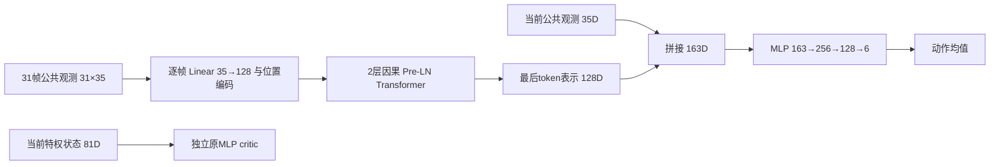

# 从当前 V6 MLP 到历史 Transformer

本文区分网络结构、历史信息、实时控制和能力保持。普通 MLP 的结构来自 V6 基线；新网络与独立训练、对比、选型和部署流程使用 35D 公开观测、81D 特权 Critic 与 100Hz 策略合同。

工程判断：历史网络值得用于实时控制对照，首要检验其对短时响应判断与动态适应的帮助。对照固定为单帧 MLP、历史 MLP 编码器与多种 Transformer，统一使用 100Hz；参数规模按结构需要选择，架构收益、容量收益和能力保持分别分析。

## 1. 当前普通 MLP 的实际实现

运行冻结源码为 `1f9a884368e772741c269567a1b4b3c21f371349`，合同为相邻仓库的 `contracts/v6_new_asset_training_v1.json`。`train_chassis.py` 经 Isaac Lab 配置适配器构造 RSL-RL 5.5.1 的独立 actor/critic：

```text
公共观测35D → Linear256 → ELU → Linear128 → ELU → Linear64 → ELU → Linear6
特权状态81D → Linear256 → ELU → Linear128 → ELU → Linear64 → ELU → Linear1
```

Actor 最后一层为未限幅的动作均值。训练采样
\(a_t^{raw}\sim\mathcal N(\mu_\theta(o_t),\operatorname{diag}(\sigma^2))\)，评测取均值。六轴各有一个状态无关的可学习σ，当前初始化为1.0；配置类里旧默认0.2会被合同覆盖。`scalar`不表示六轴共用一个数。

\[
P_{actor}=(35+1)256+(256+1)128+(128+1)64+(64+1)6=50,758.
\]

加探索参数后为50,764，critic为62,209，总训练参数112,973。Actor和critic没有共享特征网络。

这与华南虎**普通 WheelbipeV14FlatPPORunnerCfg**的单帧、`[256,128,64]`、ELU、初始σ1.0同型；不能泛指其DreamWaQ/HIM等所有变体。[SCUT固定版本网络配置](https://github.com/scutrobotlab/wheeled-legged_RL/blob/b8ff79f3df855faf9dc92f4a282bd80c42649466/source/agent_tasks/agent_tasks/direct/wheelbipe/agents/rsl_rl_ppo_cfg.py)

我方81D critic、人工请求语义、1kHz物理/PD、奖励、采样和课程均有独立合同。SCUT普通V14的特权观测与物理频率不同，网络同型不等于整个任务相同。[SCUT V14环境配置](https://github.com/scutrobotlab/wheeled-legged_RL/blob/b8ff79f3df855faf9dc92f4a282bd80c42649466/source/agent_tasks/agent_tasks/direct/wheelbipe/wheelbipe_V14/env_cfg.py)

### 35D已经包含哪些信息

来自当前 `scut_observation.py::build_manual35`，索引从0开始：

|槽位|含义|
|---|---|
|0–2 / 3|vx、vy、yaw角速度命令 / 高度命令×5|
|4–6 / 7–9|IMU角速度×0.5 / 投影重力|
|10–15|相对电机角度，wrap到±π；两个轮位置槽置零|
|16–21|六轴电机速度×0.1|
|22–27|上一条经过控制器限幅的动作，按policy轴序|
|28 / 29 / 30 / 31 / 32|normal / stair / 保留slope / stair恢复 / jump请求|
|33 / 34|请求幅值相关高度×5 / 0–5s命令参考时钟|

“无历史帧”是没有显式观测窗口，仍有上一动作和命令时钟。上一动作是发出的指令，不等于实际执行力矩。Actor不读取真实机体线速度、真实高度、接触力或地形真值。

PPO保存未裁剪动作及其log-prob；执行层再将腿/轮限到±3/±9，腿目标为nominal+0.25a，轮目标为10a。策略50Hz，物理/PD反馈1000Hz；每个策略周期20次反馈控制。这些处理保持在网络之外。

## 2. 当前回退证据不能被网络假设覆盖

2026-09-29北京时间10:09只读快照：S1为320/1000更新、1.536亿转移，正在固定评测。320的评测当时尚未完成；这是历史快照，不是实时进度。以下来自同一训练seed的完整固定用例：

|更新|主评测seed通过/16|305mm高度MAE|最大站立漂移|前进0.5m/s速度MAE|
|---:|---:|---:|---:|---:|
|200|6|2.095mm|5.366cm|0.0564m/s|
|240|3|0.855mm|45.393cm|0.0196m/s|
|280|5|1.685mm|15.125cm|0.0153m/s|

第二评测seed通过数为6/3/4，漂移趋势相符；两个评测seed不是两个训练seed。高度持续达标，前进跟踪改善，静止漂移回退，说明能力取舍/训练不稳定确实存在。在该快照中尚未进入S2–S6，不能据此宣称已经发生跨技能灾难性遗忘或容量不足。

两个重要混杂：

- 第200个actor更新后，相关高度采样路径从80%固定九档+20%连续变为50%固定+50%连续。通过固定分支抽到指定一档的概率由0.8/9变为0.5/9，下降37.5%；给定已进入固定分支，各档概率仍为1/9。这不是所有训练样本下降37.5%，时间相邻也不足以证明因果。
- LR使用adaptive。200/240块末LR为8.779e-4，280为3.902e-4，320为2.601e-4；不能把初始1e-4当实际恒定值，也不能把块末值当期间峰值。

读取时间、原始来源和SHA见相邻工作区的[只读审计报告](../../robot_rl/isaac_wheeled_rl_train/reports/transformer_retention_design_20260929/SUMMARY.md)。原始运行数据不纳入本仓库提交。

当前已有旧技能复习配额、累计保护账本和有界回滚。评测门控能阻止退化策略晋级，却不能直接阻止每次梯度更新伤害旧能力。

## 3. 推荐结构：当前帧直连＋历史Transformer＋共同动作头

每个token是一整帧35D，不是把同一帧35个数当35个时间token：



\[
H_t=[o_{t-30},\ldots,o_t],\quad x_i=W_eo_i+b_e+p_i,
\]
\[
U^\ell=X^\ell+\operatorname{MHA}(\operatorname{LN}(X^\ell)),\quad
X^{\ell+1}=U^\ell+\operatorname{FFN}(\operatorname{LN}(U^\ell)),
\]
\[
z_t=\operatorname{LN}(X^2)_t,\quad
\mu_t=\operatorname{MLP}_{163\to256\to128\to6}([o_t,z_t]).
\]

4头、head_dim32、FFN128→512→128；FFN用GELU，动作头用ELU。固定位置编码、因果mask、零dropout、完整窗口重算。最后token读取全部过去帧，早期token不能看未来。Query变体使用当前35D生成独立查询，读取编码后的历史；门控变体在层深方向调节残差融合。

|项目|普通MLP|默认Transformer|
|---|---|---|
|每帧信息|公共35D|相同公共35D|
|输入|1×35|31×35，100Hz首尾跨度0.30s|
|当前状态通路|直接入MLP|当前35D直接进入融合动作头|
|动作均值参数|50,758|477,062|
|加6个探索参数|50,764|477,068|
|Critic|独立81→256→128→64→1|首轮相同|
|完整前向主要MAC|50,304|约12,895,872|

MAC仅计主要乘加，不含激活、归一化和访存，不是时延实测。默认 Transformer 参数约9.4倍，31帧重算使主要MAC约256倍；不能根据参数量猜吞吐。约18万、102万和227万参数档位用于检查容量与控制收益的关系。

当前帧直连提供即时姿态、编码器和命令，历史通路学习升降方向、制动趋势、执行迟滞与滑移迹象。它增加可用信息，但不能保证唯一恢复真实状态。无外部位置、轮位置槽置零时，0.30s历史也不能凭空保证10s绝对位置不漂移，更不能代替请求和落地完成状态机。

第一版不冻结尚未整体验收的MLP，也不默认加入四技能head。冻结弱teacher容易保留错误行为；多头仍可能通过共享Transformer发生干扰。基础对照后，若记录到长期梯度冲突，再比较请求条件adapter。只冻head不保护共享表示；完整冻结分支保持的是该分支函数，仍须闭环验收。[Progressive Neural Networks](https://arxiv.org/abs/1606.04671)

### 3.1 对实时控制的具体价值

单帧35D已有关节速度、机体角速度和上一动作；历史新增的价值主要是动作与后续响应的关系、变化趋势，以及相似当前观测之前经历了什么。下表均为待验证的假设：

|场景|历史可能提供的信息|判断边界|
|---|---|---|
|起停、正反向切换|制动后姿态与轮速如何变化，是否仍有响应滞后|轮速不等于机体真实线速度；需要用停车残速验证|
|负载或执行特性变化|同类指令产生的响应幅度、相位和恢复过程|需要足够激励；上一发出动作不能代表实际力矩|
|接触切换、落地、扰动恢复|姿态与关节响应的瞬态、振荡和恢复趋势|不能据此保证准确接触状态或接触力|
|部分滑移瞬态|轮速与机体响应的不一致迹象|持续匀速滑移可能仍不可辨，不能保证绝对位置不漂移|

RMA已在机器人上验证了策略与适应模块组合的实时适应价值，可作为研究方向的依据；它并不能证明本设计的Transformer优于堆帧MLP。[RMA原论文](https://arxiv.org/abs/2107.04034)

网络还不能从本体历史中可靠补出未接触的前方台阶、绝对位置、无接触假设下的绝对高度。超过窗口的请求生命周期、落地完成与取消处理仍由显式状态机承担。部署时可以固定参数\(\theta\)，由每次变化的历史产生不同的\(z_t\)；这属于在线推断，不要求实时反向传播，也不等于解决训练中的参数遗忘。

### 3.2 历史窗口与输出延迟

在规则100Hz采样下，31帧窗口的首尾跨度为\((31-1)/100=0.30\)秒。窗口只取过去与当前数据，不等待未来；初始化时由外部缓存重复首帧，因此也不要求启动后先等待0.30秒。历史较短的启动阶段仍需单独验证行为。

当前帧直连是进入共同动作头的信息通路。`FramePolicy.forward`仍先完成历史编码，再拼接当前帧输出动作，所以一次控制输出要等待Transformer计算完成；这里没有异步快速分支。更换为分频历史编码或缓存旧表示会引入表示年龄，属于另一种控制设计，当前代码未实现。

本轮讨论的是50/100Hz策略生成目标，快速底层反馈仍由1kHz PD承担，不能将下列网络测速解释为已验证的1kHz完整控制。

### 3.3 单样本CPU短测

2026-09-29交互测量，网络实现对应commit `1548222`：

- 本机Intel Core i9-13900H，PyTorch `2.11.0+cu128`，实际设备为CPU；float32、batch=1。
- `OMP_NUM_THREADS=1`、`MKL_NUM_THREADS=1`，PyTorch intra-op/inter-op线程数均为1。
- 使用各配置随机初始化的网络，`torch.manual_seed(0)`；`eval()`与`inference_mode()`，测试TorchScript `torch.jit.script`后的完整`forward`。
- 每种网络预热200次，测量2000次；输入为预先生成并重复使用的随机张量，用`perf_counter_ns`逐次计时，百分位由NumPy计算。31帧变体仅将`transformer.json`的`history_length`改为31。
- 未绑核、未设置实时调度；各配置顺序测试，未做随机交错。以下为交互输出的汇总，逐调用原始样本未保存。

|网络|历史帧|P50 / ms|P95 / ms|P99 / ms|观测最大值 / ms|
|---|---:|---:|---:|---:|---:|
|原MLP|1|0.0294|0.1222|0.1641|0.4285|
|扩容MLP|1|0.0400|0.1617|0.2377|0.4551|
|堆帧MLP|16|0.0341|0.0569|0.0628|0.0760|
|小型Transformer|16|0.3248|0.4574|1.0228|1.5041|
|小型Transformer|31|0.4344|1.4221|1.6773|2.0305|

这些数据只包含已就绪输入上的均值网络前向，不含传感器采集、历史缓存维护、通信、周期调度、控制器接收或物理响应。随机权重短测没有测控制质量；连续紧循环也不等价于每10/20ms唤醒一次的实际负载。环境抖动会影响尾部结果，不能据此判定堆帧MLP一定比更小MLP的尾部时延低。

对20ms的50Hz周期和10ms的100Hz周期，本机测得的网络耗时支持继续评估小型Transformer，但尚不构成目标设备的硬实时保证。有限样本的P99及观测最大值都不是最坏情况上界；后续验收必须保存运行环境、模型版本、时间戳与超时记录。

### 3.4 实时验收按动作生效和数据年龄计时

对第\(k\)个控制周期，区分预定释放时刻\(r_k\)、网络开始\(t_{start,k}\)、网络完成\(t_{finish,k}\)、动作在控制器生效\(t_{apply,k}\)，以及最新一帧中传感组\(g\)的采样时间\(t_{sample,g,k}\)。在同步时钟或有已知误差的时间映射下记录：

\[
T_{infer,k}=t_{finish,k}-t_{start,k},\qquad
T_{cycle,k}=t_{apply,k}-r_k,
\]
\[
A_{g,k}=t_{apply,k}-t_{sample,g,k}
=(t_{start,k}-t_{sample,g,k})+T_{infer,k}
+(t_{apply,k}-t_{finish,k}).
\]

截止时间由控制合同确定：\(d_k=r_k+D\)，其中\(D\)不大于策略周期。超时率为\(N^{-1}\sum_k\mathbf1[t_{apply,k}>d_k]\)，\(N\)涵盖全部预定周期；未产生、丢失或未生效的动作以\(t_{apply,k}=+\infty\)计入，不能仅统计成功执行的周期。若只测到动作发送时刻，就报告发送时延，不能当作执行生效；传感器到达时间也不能替代其采样时间。网络输出、控制器采用动作、实际电机响应是不同事件。

物理响应另按\(T_{response}=t_{criterion}-t_{event}\)衡量，须先定义扰动/命令事件和恢复判据。它包含采样等待、执行与机体动力学、闭环恢复等过程，不能等同网络耗时。端到端P99应从端到端样本直接计算，不能相加各组件P99代替。

进入部署判断前，需要在目标设备及代表性负载下记录P50/P95/P99、最大时延、超时率和各传感组年龄，覆盖冷启动、持续运行及负载变化；按已有控制合同验证迟到动作、过期输入的处理。时延与年龄预算、恢复判据均应在对比前确定。实时合格后，再比较停车残速、恢复时间、动作振荡、跌倒与饱和，确认计算开销确实换来了控制收益。

## 4. 能力保持是独立训练机制

历史编码\(z_t=E(H_t)\)解决当前episode的信息问题；旧任务回报\(J_j(\theta_{k+1})<J_j(\theta_k)\)属于更新后的能力退化。若最小化新任务损失，\(\theta'=\theta-\eta g_{new}\)，则

\[
\Delta L_{old}\approx-\eta g_{old}^{\top}g_{new}.
\]

负梯度内积会增加旧损失；attention本身不约束该内积。PPO clipping只针对当前rollout采样分布，并不保证所有旧技能回报不下降。[PPO原论文](https://arxiv.org/abs/1707.06347)

建议在独立对照中加入：

1. **分层fresh复习。** 在已有行为池内保证不同站高、静止、正反速度、起停和技能恢复的覆盖，使用当前策略重新采样。记录有效transition和回合占比。固定200前后高度混合、LR上限等诊断必须与架构臂分开，不能同时改后把收益全归网络。
2. **已验收区域teacher约束。** 保存不可变合格checkpoint及其适用区，对独立训练锚点约束行为。未通过的停车/后退不能作为强制模仿目标；一个case通过也不代表所有状态都可靠。不同teacher区域重叠时先解决归属/冲突。[Policy Distillation](https://arxiv.org/abs/1511.06295)

候选损失：

\[
L=L_{PPO}+c_VL_V-c_H\mathcal H+\lambda_{keep}
\mathbb E_{H\sim B_{anchor}\cup D_{old,fresh}}
q(H)D_{KL}(\pi^*(\cdot|H)\Vert\pi_\theta(\cdot|H)).
\]

\(q\)仅是teacher适用权重，不作为actor输入。旧MLP teacher取同一历史的末帧，新学生取完整窗口。对角高斯KL为

\[
\sum_a\left[\log\frac{\sigma_{\theta,a}}{\sigma^*_a}
+\frac{(\sigma^*_a)^2+(\mu^*_a-\mu_{\theta,a})^2}{2\sigma_{\theta,a}^2}-\frac12\right].
\]

比较原始策略域，不用已裁剪动作代替概率分布。记录均值与方差两部分；也可消融按六轴动作尺度归一的均值损失，探索方差独立处理。

锚点来自训练场景/独立随机种子，不能用最终留出评测轨迹训练。旧历史和teacher输出可做监督损失；旧动作、GAE、value target不能直接当作当前PPO样本。保持损失应计入同一受监控的actor更新及KL，不能在PPO之后再无约束改actor。Critic学习fresh旧场景的当前return，不强行复制旧策略/旧奖励下的value。

这些机制仍不保证闭环不遗忘。继续逐能力验收，报告相对固定已验收参考的误差变化、丢失通过项及多训练seed差异。TensorBoard建议增加 `Retention/<family>/reference_delta`、`Policy/<family>/teacher_kl`、`Sampling/<family>/transition_fraction`，明确消费更新/样本横轴，回滚不返还预算。

## 5. 有控制变量的对照顺序

|轮次|对照|区分的因素|
|---|---|---|
|A|50.8k原MLP / 183.4k单帧MLP|容量|
|B|单帧MLP / 历史MLP / 默认Transformer|历史压缩与内容关联|
|C|末帧读出 / 当前帧Query读出 / 深度门控残差|历史选择与优化结构|
|D|178.8k / 477.1k / 1017.8k / 2273.0k Transformer|容量与计算成本|
|E|三个家族分别启用/关闭同一保持机制|结构与保持训练|

主要比较至少3个独立训练seed，固定新资产、奖励、控制频率、初始σ、总转移数和固定评测合同。网络调参预算也需记录；现有adaptive LR的实际轨迹不能省略。若更换采样/学习率配方，所有架构使用同一新配方，并单列相对当前运行的差异。

同时报告高度误差、漂移、停车峰值和平均残速、前后速度、动作变化、跌倒、饱和与吞吐。不能只比总reward或通过数量。S5训练辅助窗口与无辅助评测必须相同处理。

### 5.1 先比较控制收益，再比较策略频率

在相同100Hz下比较单帧MLP、31帧历史MLP、31帧Transformer；历史首尾跨度保持0.30秒。重点检验命令阶跃/起停、扰动恢复、接触切换后的动作与响应。相同控制质量下，也应将较低推理成本纳入选择。无需刻意让所有候选参数相近；实际结构与容量差异随结果一起记录。

100Hz把策略指令保持时间从20ms缩到10ms，可能改善快速扰动、起停和落地后的响应，但不会提高已经为1kHz的PD反馈频率。若传感器没有提供更新的信息，或者执行迟滞占主导，升频不一定改善控制。第3.4节的动作生效时延与年龄测量用于识别这一限制。

### 5.2 100Hz的时间语义与计算预算

保持0.30秒首尾跨度时，100Hz需要31帧。按本实现完整窗口重算、普通残差、d=96、两层、FFN=192计，主要MAC为

\[
C(L)=35\cdot96L+2(4L\cdot96^2+2L^2\cdot96+2L\cdot96\cdot192)
+131\cdot128+128\cdot64+64\cdot6.
\]

这是密集矩阵乘加口径；因果mask不意味着当前实现跳过了被mask位置的计算。仍不计激活、归一化和访存。

|策略频率|历史帧|首尾跨度|主要MAC/动作|主要MAC/秒|
|---|---:|---:|---:|---:|
|50Hz|16|0.30s|2,536,704|126,835,200|
|100Hz|16|0.15s|2,536,704|253,670,400|
|100Hz|31|0.30s|5,069,664|506,966,400|

所以保持跨度再升频，每秒主要计算约为当前方案的4倍，不是2倍。参数量不随窗口长度增加，因为这里的位置编码是固定buffer；训练激活与历史缓存仍会增长。31帧短测仅验证这项配置的前向开销，没有证明原50Hz策略可以直接提频使用。

当前`FramePolicy`只有索引位置编码，未显式输入采样间隔和传感器年龄；35D中的命令时钟不能代替它们。修改历史长度或采样频率必须更新模型/观测合同，并在新时间尺度上训练或适配后评测。对不规则采样，记录真实时间并定义重采样/过期处理，或另行研究显式时间输入，不能让相同token间隔默认代表任意时长。

保持连续时间折扣时，\(\gamma(\Delta t)=e^{-\beta\Delta t}\)，因此\(\gamma_{100}=\sqrt{\gamma_{50}}\)；若也保持GAE的\((\gamma\lambda)\)物理衰减时间，则\(\lambda_{100}=\sqrt{\lambda_{50}}\)。例如0.99/0.95对应约0.994987/0.974679。该换算保持衰减时间常数，不保证两种离散控制过程的学习结果相同。

24步rollout改48步才保持0.48s，但相同环境数与rollout轮数下转移数随之翻倍，必须同时报告物理时间、样本数和优化步数。按时间积分的奖励要核对dt，一次性事件罚分保持事件口径；当前新奖励的死亡200已经是一次性事件，不沿用旧版200×dt假设。一阶、二阶动作差分平方惩罚分别换算4倍、16倍。架构对照统一固定100Hz，升频本身的收益另做50/100Hz消融。

## 6. 训练与部署组织

网络、优化、环境和执行合同分别管理。`FramePolicy` 统一输出原始动作均值；训练层增加 Gaussian 探索与独立 Critic，采集层保留完整历史快照和 reset 前终态，PPO 使用原始采样动作的行为概率。部署只执行历史编码、动作头、限幅和目标映射。

网络对照包括华南虎式单帧 MLP、复旦式历史 MLP 编码器与当前帧直连，以及末帧读出、Query读出、门控残差和容量扩展 Transformer。尺寸、瓶颈维度与历史长度通过配置控制。门控 Transformer 在深度方向融合特征，无递归时间状态。[GTrXL 原论文](https://proceedings.mlr.press/v119/parisotto20a.html)

各候选在独立研究场景中使用同一 PPO 配方；比较时共同固定奖励、频率、Critic、探索初始化、课程和样本预算。旧主线训练器的结果另作外部参考，避免把优化器或任务差异算作网络收益。

能力保持通过累积场景验收、独立 teacher 锚点及学习状态回退组织。锚点使用独立随机种子，留出评测不参与梯度更新。回退恢复权重、优化器与随机数状态，但不返还消费预算；环境与历史重新初始化。最终选择要求跨训练 seed 的任务门限和实测延迟同时通过。

完整命令、配置与接口见 [35D 训练、对比与部署](FRAME_TRAINING.md)。核心配置为 [frame_training.json](../configs/frame_training.json)，入口为 `python -m transformer_rl frame`。历史均为旧到新、reset 重复首帧，35D 特征不追加重复动作或时间字段。独立的默认 30D 时间编码观测仍由自己的合同管理。
