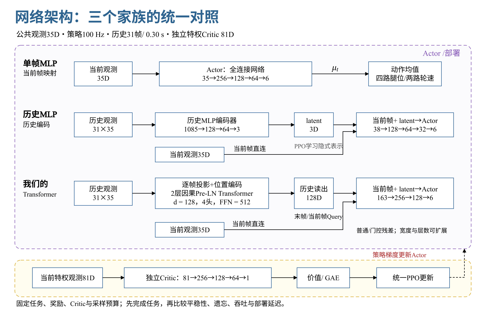

# 35D 历史策略：训练、对比、选型与部署

策略以 **100 Hz** 更新，物理与 PC 反馈控制以 **1000 Hz** 更新。公开观测保持 35D，策略输出四路腿部位置动作和两路轮速动作；独立 Critic 使用 81D 特权观测。训练、评测和导出使用同一份观测顺序、动作顺序、限幅、缩放及时间合同。

## 1. 网络与训练流程



历史按旧到新排列：

\[
H_t=[o_{t-30},\ldots,o_t]\in\mathbb R^{31\times35},\qquad
z_t=E_\theta(H_t),\qquad
\mu_t=\mathrm{MLP}_\theta([o_t,z_t])\in\mathbb R^6.
\]

当前帧直接进入控制头，历史编码器用于解释运动趋势、接触变化和未显式观测的上下文。默认 Transformer 使用两层 Pre-LN 因果注意力、固定位置编码、最后一帧读出；`d_model=128`、4 个头、`ffn_dim=512`，动作头为 163→256→128→6。保持机制与网络结构分别配置。

| 对照 | 输入与编码 | 主要用途 |
|---|---|---|
| 单帧 MLP | 当前 35D → MLP | 检查无历史的即时反馈与扩容收益 |
| 历史 MLP | 展平历史 → 小 latent；当前帧直连 | 检查固定时间槽与历史压缩的作用 |
| 末帧 Transformer | 因果注意力后取最后 token；当前帧直连 | 内容关联的标准候选 |
| Query Transformer | 当前帧生成 Query，读取编码后的整段历史；当前帧直连 | 检查历史选择方式的收益 |
| 门控 Transformer | 深度方向的门控残差 | 检查优化稳定性与技能保持 |
| 容量扩展 Transformer | 加宽表示、FFN 或增加层数 | 检查容量是否限制表达能力 |

历史 MLP 与 Transformer 接收同一完整窗口，每次重算，不保留跨调用隐藏状态。环境 reset 后，每个环境行单独重复首帧初始化历史；reset 跳变不作为动作抖动。每项对照使用相同 Critic、PPO 配方、初始探索标准差及训练预算，实际参数量和样本数另外记录。本轮默认对照仅含这三个家族。

| 预设 | 编码器 / 动作头 | 均值网络参数 |
|---|---|---:|
| `mlp` | 35→256→128→64→6 | 50,758 |
| `mlp_medium` | 35→512→256→128→6 | 183,430 |
| `history_mlp` | 1085→128→64→3；38→128→64→32→6 | 162,985 |
| `history_mlp_wide` | 1085→256→128→64→16；51→256→128→64→6 | 375,062 |
| `transformer_small` | d=96，2层，4头，FFN192；131→128→64→6 | 178,758 |
| `transformer` | d=128，2层，4头，FFN512；163→256→128→6 | 477,062 |
| `transformer_query` | 默认结构＋当前帧 Query 读出 | 531,462 |
| `transformer_gated` | 默认结构＋深度门控残差 | 871,814 |
| `transformer_large` | d=160，3层，5头，FFN640；195→256→128→6 | 1,017,766 |
| `transformer_xlarge` | d=192，4层，6头，FFN1024；227→256→128→6 | 2,273,030 |

表中只计算部署均值网络的可训练参数；训练另有 6 个探索参数与 62,209 参数的独立 Critic。观测与动作均采用本项目的 35D/6D 合同。历史 MLP 的 3D latent 由 PPO 学习，不预设为三维速度。

末帧、Query 与门控候选保持相同 Transformer 宽度、层数、FFN、历史与动作头；读出模块和门本身会增加参数，其额外成本随结果一起报告。容量档位另行比较，不以参数相近作为选型前提。共同配方用于第一轮筛选，后续每种结构的调参预算也应相同。

对 Query 读出，令编码后的 tokens 为 \(Z\)，当前观测产生 \(q=W_qo_t+b_q\)：

\[
z_t=\operatorname{LN}\!\left(q+W_o\operatorname{Concat}_h
\left[\operatorname{softmax}\!\left(\frac{q_hK_h^\top}{\sqrt{d_h}}\right)V_h\right]\right).
\]

Query 只读取已经观测到的历史，所有 token 的编码仍使用因果 mask。深度门控也在单次前向内计算，不维护递归时间状态。

训练循环为：**独立场景采样 → 历史快照 → 高斯采样 → 动作限幅 → 环境反馈 → reset 前终态 → GAE → PPO → 密封检查点 → 新旧场景评测**。真正终止不 bootstrap；超时使用 reset 前 Critic 输入 bootstrap，并切断跨回合 GAE。

\[
u_t\sim\mathcal N(\mu_\theta(H_t),\mathrm{diag}(\sigma_\theta^2)),\quad
\bar u_t=\mathrm{clip}(u_t,-b,b),\quad
y_t=y_0+s\odot\bar u_t.
\]

PPO 的概率比使用原始采样动作 \(u_t\)，观测中的上一动作使用实际发出的限幅动作 \(\bar u_t\)。传输到达、控制器应用和电机响应是后续事件，环境负责模拟这些事件。

## 2. 100 Hz 的时间尺度

| 项目 | 配置 |
|---|---|
| 策略周期 / 物理周期 | 0.01 s / 0.001 s，decimation=10 |
| 历史 | 31 帧，首尾跨度 `(31−1)×0.01=0.30 s` |
| Rollout | 每环境 48 步，0.48 s |
| 折扣 | `gamma=sqrt(0.99)`、`gae_lambda=sqrt(0.95)` |
| 默认并行环境 / minibatch | 4096 / 32 |
| 观测与推理精度 | float32 |

保持物理时间折扣时，\(\gamma(\Delta t)=e^{-\beta\Delta t}\)，因此从 50 Hz 改到 100 Hz 对 \(\gamma\) 和 \(\lambda\) 取平方根。原任务的奖励密度已经乘策略周期，离散成功/失败事件奖励保持事件口径。

原任务一阶、二阶动作差分惩罚没有显式除以周期。对于相同连续动作轨迹，\(\Delta u\propto\Delta t\)、\(\Delta^2u\propto\Delta t^2\)。新适配器将它们的平方惩罚分别乘 **4** 和 **16**，保持原 50 Hz 配方对应的物理变化率权重；已经除以周期的加速度项不重复换算。

31 帧的历史快照需要额外显存。`inspect` 输出历史存储峰值的下界，不包含网络激活、优化器及物理场景；应在启动前按机器容量选择并行环境数，所有候选保持一致。这里的 4096 环境、48 步与原主线 20000 环境、24 步具有不同样本量，不能把相同更新次数称为相同样本预算。

## 3. 准备实验

在包含 Isaac Lab、PyTorch 的独立运行环境中安装本仓库；SDK 由已有仿真环境提供。普通网络检查与单元测试不需要 SDK。

```bash
python -m pip install -e '.[test,train,export]'
python -m transformer_rl frame inspect --config configs/frame_training.json
```

准备工具读取既有课程，复制任务源码、模型资产和控制参数，生成新的 100 Hz 研究合同。任务依赖使用 SHA256 固定；`plan` 另复制策略与优化源码，后续 worker 从这些快照加载。准备操作只写文件，不启动仿真，不改正在运行的 V6 训练。

```bash
python -m transformer_rl frame prepare-chassis \
  --source-root ../robot_rl/isaac_wheeled_rl_train \
  --curriculum contracts/v6_new_asset_training_v1.json \
  --directory runs/prepared_screen --round screen

python -m transformer_rl frame plan \
  --spec runs/prepared_screen/study.json --root runs/network_screen
```

`screen` 包含 10 个候选、单训练 seed、S1 的 200 次更新，用于检查学习与资源开销。筛选轮的 seed 数不足以产生正式赢家。`confirm` 包含三训练 seed、全部六阶段和总计 8500 次更新；在计划生成前，可以在 `study.json` 中保留筛选后的候选，并为所有候选指定相同阶段预算。

```bash
python -m transformer_rl frame prepare-chassis \
  --source-root ../robot_rl/isaac_wheeled_rl_train \
  --curriculum contracts/v6_new_asset_training_v1.json \
  --directory runs/prepared_confirm --round confirm
```

S1–S6 使用原课程的技能与场景设计，每个新阶段都累加此前的固定验收场景。默认两个课程验收 seed（701/1701）、两个最终留出评测 seed（2701/3701）、每场景 16 个环境、4001 步；兼容场景合并在同一次仿真中运行，报告仍逐场景分开。改变动力学、通信或回合规则的场景必须分批。

`study.json` 配置网络列表、训练/锚点/验收/最终评测 seed、课程、物理门限、归一化评分尺度、预算、设备及延迟门限。配置在 `plan` 后不可修改；配方或源码改变时生成新的计划目录。

首次接入机器时，可先用较小的独立准备目录检查真实 SDK 接口：

```bash
python -m transformer_rl frame prepare-chassis \
  --source-root ../robot_rl/isaac_wheeled_rl_train \
  --curriculum contracts/v6_new_asset_training_v1.json \
  --directory runs/prepared_check --round screen --num-envs 64 --evaluation-replicas 4
python tools/check_frame_pipeline.py \
  --prepared runs/prepared_check --directory runs/pipeline_check
```

该检查对十种配置分别执行 2 次更新、完整学习状态恢复后再更新 1 次、短固定场景评测、导出一致性检查和 CPU 延迟采样。报告检验接口是否贯通；短训练和短评测不参与模型质量排名。正式结构对比使用独立 `screen` / `confirm` 计划。

## 4. 运行与恢复

执行以下命令会启动新的机器人仿真训练。

```bash
python -m transformer_rl frame run --root runs/network_screen --max-parallel 1
```

每个设备只运行一个 worker；多 GPU 在计划生成前配置 `execution.devices`，再提高 `--max-parallel`。训练 worker、评测 worker 和 SDK 生命周期各自结束后才启动下一项，默认串行适合与现有主线共用机器时安排资源。

默认每 200 次更新进行一次课程验收；48 步 rollout 对应每段每环境约 96 s 的仿真时间。每段使用独立进程，续跑时环境与历史重置，片段长短是所有候选共同的实验条件。每个训练片段记录完整配置、环境来源、PPO 指标、样本数和 TensorBoard。检查点保存 Actor、Critic、Adam、学习率状态、更新号及 PyTorch/CUDA/Python/NumPy RNG；环境和历史在续跑时重置，不宣称恢复了仿真物理状态。

```bash
tensorboard --logdir runs/network_screen/jobs
```

SIGINT/SIGTERM 会请求在收集/更新边界停止并保存学习状态。重新执行同一个 `run` 命令续跑。已经完成的作业不会重写；评测失败可以仅重试评测。硬崩溃后，若无法证明实际消耗的更新数，整段预留预算计为已消耗；回退不退还更新或样本预算。

| 单项训练入口 | 学习状态处理 |
|---|---|
| `--resume checkpoint.pt` | 完整相同配置恢复权重、Adam、RNG 和更新号 |
| `--initialize-from checkpoint.pt` | 同结构/控制合同迁移权重，新阶段新 Adam |
| `--restore-learning-from checkpoint.pt` | 课程回退恢复权重、Adam、RNG；采样时钟继续按已消耗预算推进 |

自定义环境实现 [`VectorEnv`](../src/transformer_rl/types.py)，并提供 reset 前的成功标志、任务误差、信号及终态。入口还校验 `metadata.identity` 与观测/动作/周期合同的 `control_sha256`。通用环境可用 `frame train` / `frame evaluate` 单独运行；底盘 SDK 环境的单项命令使用 `python -m transformer_rl.frame_process train` 或 `evaluate`，保证 SDK 在专用进程中启动和关闭；`configs/frame_training.json` 的空环境配置用于离线检查，实际仿真配置由准备工具生成。

## 5. 遗忘检测与保持训练

每个训练片段评测当前阶段及所有旧场景。验收同时检查成功率、姿态、跟踪误差与静止漂移，持续与每项旧技能的固定最好参考分数比较，防止每段小幅退步逐渐累积。超过退步容差时恢复最近完整验收模型及优化器；超过回退次数或阶段预算后仍不合格，该 seed 被拒绝。

可选的保持目标为：

\[
\mathcal L=\mathcal L_{PPO}+c\,\mathbb E_{H\sim\mathcal D_{anchor}}
D_{KL}\!\left(\pi_{teacher}(\cdot\mid H)\Vert\pi_\theta(\cdot\mid H)\right).
\]

将 `training.retention_coef` 从 0 改为正数启用。独立锚点 seed 默认为 4101/5101，与训练、课程验收、最终留出评测 seed 互不重叠。阶段验收后，用独立锚点场景采集完整历史与冻结 teacher 的均值/标准差，仅采纳同样通过任务门限的 teacher 场景；包含 reset 后的短期响应。下一阶段按场景文件均匀采样，再在文件内均匀采样；锚点在本阶段内保持不变。

最终留出评测仅在全部课程完成后运行，不用于回退、锚点或训练调度。该损失在同一次 PPO 优化和梯度裁剪中更新。旧轨迹不携带当前 PPO 的优势或概率比，不能当作 on-policy rollout。结构比较默认关闭保持损失；研究保持效果时，为单帧 MLP、历史 MLP、Transformer 使用相同的独立保持实验组，额外锚点采集成本也需要记录。

## 6. 选择与导出

```bash
python -m transformer_rl frame select --root runs/network_confirm
```

选型依次要求：全部阶段与相同预算完成、所有训练 seed 与评测场景齐全、任务门限通过，持续跟踪/站立的稳态样本足够、部署图与评测检查点一致、同机器实测延迟通过。稳态统计逐环境逐回合去均值，去掉 reset 后前 200 步；姿态/高度/速度偏差和失败统计仍独立记录。`require_steady` 对持续跟踪/站立启用；短时跳跃、落地、穿越任务按各自成功与误差门限验收，不因成功回合短而被当作稳态样本不足。

评分对场景、评测 seed 等权平均，再对训练 seed 使用 **均值 + 标准差惩罚**。标准差是跨训练 seed 的样本标准差，不是置信区间。部署实例取接近中位表现的训练 seed。`selection.json` 同时输出 `best_transformer`、`best_overall` 和两者是否相同；没有合格 Transformer 时返回 `no_eligible_transformer` 和非零退出码，不强行指定赢家。

每个合格作业已有部署目录，最终文件路径记录在 `best_transformer.deployment.path` 对应 manifest 的父目录。也可从通过验收的检查点独立导出：

```bash
python -m transformer_rl frame export \
  --checkpoint PATH_TO_CHECKPOINT --directory runs/exported_policy
python -m transformer_rl frame benchmark \
  --directory runs/exported_policy --output runs/exported_policy/latency.json
```

导出包括 TorchScript、ONNX、观测与执行合同、文件 SHA256 和 eager/script/ONNX 数值一致性报告。动态维仅为 batch，历史长度和特征数固定。Critic、Gaussian 探索和优化器不进入控制模型。默认实测 1000 次 CPU 调用，包括历史推进、均值推理、限幅及目标映射；门限为 p99 ≤ 8 ms、最大值 ≤ 10 ms、没有周期超时。

## 7. 接入实时控制

部署运行时 [`FrameRuntime`](../src/transformer_rl/frame_runtime.py) 仅需要 NumPy 和 ONNX Runtime；TorchScript 后端另需 PyTorch。硬件输入按 manifest 中的顺序和缩放构造 float32 35D 观测；退出、失步或故障恢复后显式清空历史。

构造运行时会先加载并验证模型，再默认执行 50 次静态形状的均值前向预热。预热发生在启动控制循环之前，不读取传感器、不生成或发送动作；结束后清空历史，第一帧真实观测填满历史窗口。预热中的输出形状、float32 类型或有限数检查失败时，构造直接报错。次数可通过 `priming_iterations` 指定为正整数，预热耗时记录在 `runtime.preparation`。模型加载和预热不计入控制循环或稳态 benchmark 的耗时；控制循环仍保留原有截止时间检查，预热不保证后续调用满足实时预算。

```python
from transformer_rl.frame_runtime import FrameRuntime, run_control_loop

runtime = FrameRuntime(
    "PATH_TO_SELECTED_BUNDLE",
    observation_schema="manual_scaled35",
    policy_dt_s=0.01,
)
run_control_loop(
    runtime,
    read_frame=read_scaled_observation,
    send_targets=publish_motor_targets,
    should_stop=shutdown_requested,
    on_fault=enter_safe_controller_state,
)
```

`read_frame` 返回缩放后的观测和单调时钟采集时间。`send_targets` 接收按 manifest 动作顺序排列的四路腿部弧度目标、两路轮速目标和本次限幅动作，后者用于下一帧的 `previous_issued_action`。对应源资产的顺序是 `L_joint1, LL_joint1, R_joint1, RR_joint1, L_joint3, R_joint3`。

腿部目标为标称角加动作缩放，连续关节的 PC 反馈控制使用最短角差 `atan2(sin(target−q), cos(target−q))`；轮速目标单位 rad/s。1000 Hz 控制线程使用最新传感器状态计算反馈力矩，100 Hz 推理线程只更新目标。manifest 内的标称位置来自选型时固定的资产；硬件的标定、关节限位、力矩上限和故障状态由实际控制器接入。

调度循环检查传感器新鲜度、策略周期与推理预算；首次故障即退出，清空历史并调用 `on_fault`，由控制器确认恢复后重新启动。正常停止也清空历史，以 `InterruptedError` 通知该处理器接管控制。CPU 测时不包含传感器 I/O、通信和力矩环；最终链路仍需在目标 PC 上测量完整截止时间。100 Hz 的策略采样也不能代替下位机高频电流环测量。
