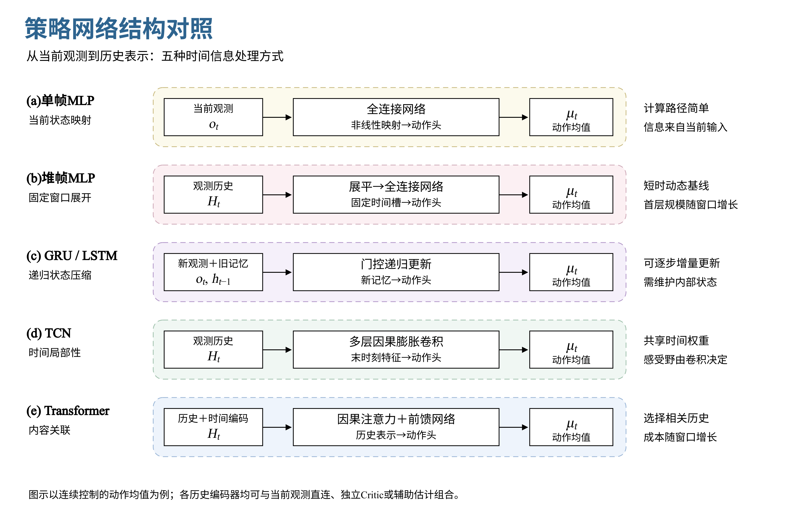
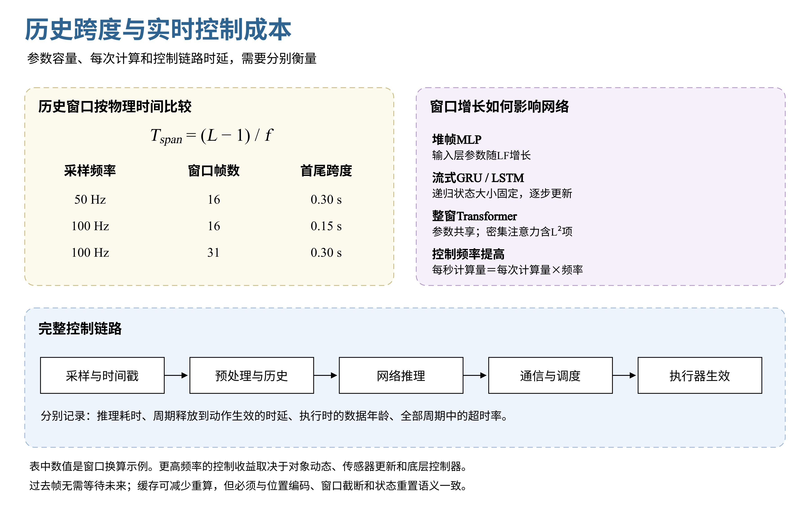

# 强化学习策略网络：结构原理、特点与选型

策略网络决定如何把观测转成动作。网络选型需要同时考虑可观测信息、任务的时间依赖、训练难度和部署成本。参数量扩大可以增强函数表达能力；历史编码则为策略提供动态上下文。两者解决的问题不同，应分别比较。

## 1 策略网络的共同框架

设单步观测为 $o_t\in\mathbb R^F$，动作为 $a_t\in\mathbb R^A$，长度为 $L$ 的历史窗口为：

$$
H_t=[o_{t-L+1},\ldots,o_t]\in\mathbb R^{L\times F}.
$$

单帧策略直接使用当前观测；历史策略先提取表示，再输出动作。一个常见的组合是“历史编码器＋当前观测直连＋动作头”：

$$
z_t=E_\theta(H_t),\qquad \mu_t=f_\theta([o_t,z_t]).
$$

当前观测直连保留即时反馈信息，历史表示提供过去的变化与响应线索。连续控制中，动作头可输出确定性动作，或输出高斯策略的均值与尺度；离散控制则通常输出各动作的概率。动作范围、概率分布和执行映射应与任务一起设计。

如果观测已足以区分控制所需的状态，单帧网络往往是有效起点。若接触、载荷、执行迟滞或部分速度只能从时间变化中推断，历史编码更有价值。但增加历史并不保证所有隐藏状态都可辨识。

非对称Actor-Critic是训练组织方式，可以与MLP、循环网络或Transformer组合：Actor读取部署可获得的信息，Critic可在训练时读取更完整的状态。它不限定Actor的网络家族，也不要求Actor与Critic共享参数。

## 2 主要网络结构对比

*图1｜单帧映射、窗口展平、递归记忆、因果卷积和内容注意力。F、L、d与A表示观测维度、窗口长度、表示宽度和动作维度。*

| 结构 | 核心思想 | 主要优势 | 主要代价或局限 | 适用场景 |
| --- | --- | --- | --- | --- |
| 单帧MLP | 当前观测直接映射到动作 | 计算简单、容易调试、推理成本低 | 无显式观测历史；扩容不能自动补足缺失信息 | 状态较完整、反馈快速、低维连续控制 |
| 堆帧MLP | 固定窗口展平后送入全连接网络 | 实现思路直观，可学习短时变化 | 首层参数随窗口增长；时间槽固定 | 短时迟滞、起停动态、简单历史基线 |
| GRU / LSTM | 用递归状态压缩历史 | 单步增量更新，内部状态大小固定 | 时间递推有串行依赖；压缩可能丢失细节 | 流式观测、持续上下文、资源受限控制 |
| TCN | 用因果卷积提取多尺度时间模式 | 时间权重共享，整段训练可并行 | 感受野由卷积核、膨胀率和层数决定 | 局部动态、周期模式、短中时序建模 |
| Transformer | 按内容对历史片段进行加权关联 | 可以直接关联窗口内相隔较远的信息 | 密集注意力成本随窗口平方增长；时间信息需显式编码 | 关键事件间隔变化、多模态融合、复杂时序依赖 |
| 门控Transformer | 用门控调节深层残差信息流 | 有助于控制更新幅度和优化行为 | 增加参数与算子；效果依赖初始化和训练配方 | 注意力模型优化不稳定、需要更深表征的任务 |
| 估计器＋策略 | 先估计状态或环境表示，再生成动作 | 中间量可诊断，可利用训练监督 | 估计误差会传递；训练标签和部署输入需一致设计 | 速度估计、接触推断、载荷或地形适应 |
| 多头 / Adapter | 共享表征，按任务分配部分参数 | 可分离部分任务差异，扩展输出行为 | 需要路由与切换设计；共享表征仍可能受干扰 | 多技能控制、任务切换、行为差异较大 |
| CNN / 视觉编码器 | 利用图像、深度图等空间结构 | 共享局部特征，适合高维感知 | 感知成本与噪声会影响整个控制链 | 视觉导航、地形感知、抓取等任务 |

**MLP与堆帧。** 单帧MLP学习 $a_t=f(o_t)$，堆帧MLP学习 $a_t=f(\mathrm{vec}(H_t))$。后者可以拟合速度变化或延迟响应，但不同时间槽通常具有不同的首层权重。扩大窗口时，输入层也随之增长。

**GRU与LSTM。** 循环网络按 $h_t=G(o_t,h_{t-1})$ 更新记忆；LSTM还显式维护细胞状态。流式使用时，历史不必每一步全部重算。训练需保持序列边界、初始状态与episode reset的一致性；“每次从零处理一个窗口”和“跨调用保留状态”是两种不同使用方式。[GRU论文](https://arxiv.org/abs/1406.1078)给出了门控递归表示的基础形式。

**TCN。** 因果卷积只读取当前与过去位置，膨胀卷积在不同比例的时间间隔上采样。对步长均为1、按层串联的卷积路径，感受野为：

$$
R=1+\sum_{\ell=1}^{K}(k_\ell-1)\,\delta_\ell.
$$

其中每个实际卷积层分别计入，$k_\ell$为卷积核大小，$\delta_\ell$为膨胀率。增大感受野不等于所有历史都能被同样有效地利用；仍需结合任务的动态时标选择结构。[TCN研究](https://arxiv.org/abs/1803.01271)系统比较了卷积与循环序列模型。

**Transformer。** 以整帧观测作为token是一种常用方式，也可按传感器或模态划分token。因果注意力形式为：

$$
\mathrm{Attention}(Q,K,V)=\mathrm{softmax}\!\left(\frac{QK^\top}{\sqrt{d_h}}+M\right)V,
\qquad M_{ij}=\begin{cases}0,&j\le i,\\-\infty,&j>i.\end{cases}
$$

内容关联使模型能够选择相关历史，但注意力本身不提供时间顺序，需要位置或时间编码。控制周期不规则时，还应考虑时间间隔和数据年龄。因果mask限制可见信息，不意味着普通密集计算自动省去被遮挡位置的运算。[Transformer原论文](https://arxiv.org/abs/1706.03762)介绍了缩放点积注意力和多头结构。

## 3 历史编码与训练机制如何组合

**历史编码器与当前帧直连。** 历史分支负责提取动态上下文，当前帧分支保留未经历史压缩的信息。这种组合可使用MLP、GRU、TCN或Transformer作为编码器。两路拼接后再输出动作时，动作仍须等待两路计算完成；直连本身不会形成独立的异步控制器。

**显式估计与隐式表示。** 若中间量有速度、接触等监督目标，表示会受到相应物理含义约束；若只由控制目标训练，latent的每一维通常没有预先规定的物理含义。环境适应也可通过“基础策略＋历史适应模块”实现，RMA是代表性设计。[RMA论文](https://arxiv.org/abs/2107.04034)

**深度门控与时间记忆。** 门控残差可以用下式表示其基本思想：

$$
x^{\ell+1}=(1-g^\ell)\odot x^\ell+g^\ell\odot f_\ell(x^\ell),\qquad g^\ell\in[0,1]^d.
$$

这是门控融合的示意式，具体结构可以采用更完整的GRU式门。门控发生在网络深度方向时，不等同于跨时间维护递归状态；Transformer-XL式跨片段记忆又是另一项设计。[GTrXL](https://proceedings.mlr.press/v119/parisotto20a.html)研究了残差路径、归一化和门控对强化学习优化的影响。

**多模态与多技能。** 视觉可以先由CNN或视觉Transformer编码，再与本体状态、命令及历史表示融合。多技能head或adapter则在共享编码器后引入任务相关参数。任务路由应与观测条件相容，并检查技能切换时的动作连续性；多头注意力与多技能动作头是不同概念。

**PPO中的Transformer与Decision Transformer。** 前者将Transformer作为策略或价值网络的编码器，仍通过策略优化目标训练；后者以目标回报、状态和动作历史为条件进行序列建模，训练数据与目标定义也随之变化。Online Decision Transformer进一步研究在线采集和微调。这些方法应分别讨论其网络结构与学习范式。[PPO](https://arxiv.org/abs/1707.06347)、[Decision Transformer](https://arxiv.org/abs/2106.01345)、[Online Decision Transformer](https://arxiv.org/abs/2202.05607)

**历史记忆与技能遗忘。** 记住一个episode中的上下文，不代表后续参数更新会保留旧技能。对旧任务损失的一阶近似为：

$$
\Delta\mathcal L_{old}\approx-\eta\,\nabla\mathcal L_{old}^{\top}\nabla\mathcal L_{new}.
$$

两个梯度方向冲突时，新任务更新可能增加旧任务损失。混合任务采样、合适的蒸馏约束、参数隔离和持续评测可分别研究；扩大网络或使用attention不能单独保证能力保持。

## 4 参数量、计算成本与实时控制

参数量描述模型容量与存储需求，运算量描述计算规模，端到端时延描述控制链实际花费的时间。三者相关，但不能互相替代。

$$
P_{MLP}=\sum_i(n_i+1)n_{i+1},\qquad \Delta P_{stack}=(L-1)F n_1.
$$

第二式比较同一MLP将输入从F维扩为LF维时的首层参数增量。对于固定位置编码、N层、宽度d、前馈宽度m的标准Transformer，忽略偏置、归一化和激活等小项，可估计：

$$
P_{Transformer}\approx Fd+N(4d^2+2dm)+P_{head},
$$

$$
C_{window}\approx LFd+N\left[L(4d^2+2dm)+2L^2d\right]+C_{head}.
$$

这里C按主要乘加MAC计，表示每个控制周期重新计算完整窗口。参数在时间位置间共享，因此窗口增长未必增加主要参数，却会增加计算与中间张量。采用缓存、稀疏注意力或其他算子后，应按实际计算路径重新评估。

*图2｜历史跨度由帧数与采样频率共同决定；参数、单次计算和完整控制时延应分别比较。数值仅为时间窗口示例。*

| 结构 | 单步部署的典型计算方式 | 主要资源特点 |
| --- | --- | --- |
| 单帧MLP | 当前观测一次前向 | 成本主要由层宽决定 |
| 堆帧MLP | 固定窗口展平后前向 | 输入层规模随LF增长 |
| 流式GRU / LSTM | 新观测与上一内部状态递推 | 单步成本不随已运行时长增长；维护递归状态 |
| TCN | 整窗重算，或缓存各层历史特征 | 时间局部性强；缓存需要与膨胀结构对应 |
| 整窗Transformer | 投影、注意力及FFN处理整个窗口 | 含L²注意力项；短窗口下投影与FFN也可能占主导 |
| 带缓存Transformer | 复用满足一致性条件的过去表示 | 节省重算但增加缓存管理；需匹配位置编码和窗口语义 |

对于多层因果Transformer，直接滑窗重算与KV缓存未必给出完全相同的结果：早期token的历史上下文及位置可能不同。应先定义所需的序列语义，再选择缓存方式。

历史首尾跨度为 $T_{span}=(L-1)/f$。例如16帧在50Hz下覆盖0.30s，在100Hz下只覆盖0.15s；保持0.30s则需要31帧。已经采集的历史不会额外等待整个窗口时长，影响决策时效的是计算、数据年龄与传输执行链。

提升频率的价值取决于对象动态、传感器更新、底层控制器和链路余量。比较50Hz与100Hz时，应同时检查历史时间跨度、每秒运算量、reward的时间积分、折扣与GAE时标、rollout物理时长和动作平滑。若按相同物理时标换算，可取 $\gamma_{100}=\sqrt{\gamma_{50}}$、$\lambda_{100}=\sqrt{\lambda_{50}}$。

实时评测应覆盖全部预定控制周期，记录从周期释放到动作生效的时延、传感器数据年龄、最大观测时延和超时率。平均值与P99有助于描述分布，但有限样本不能单独给出最坏时延保证。

## 5 公平比较与结构选型

网络比较应逐步区分“容量增加”“新增历史”“编码方式变化”和“训练机制变化”。先保持任务、奖励和训练预算一致，再给不同结构相同的调参机会，可以减少结论对某一套配方的依赖。

| 对照层次 | 控制变量 | 回答的问题 |
| --- | --- | --- |
| 容量 | 相同观测，改变MLP宽度或深度 | 单帧表达能力是否不足 |
| 历史 | 相近容量，比较单帧与历史输入 | 时间上下文是否带来收益 |
| 编码器 | 相同信息、latent宽度、直连与动作头 | MLP、GRU、TCN、attention各自的贡献 |
| 监督 | 相同结构，配对开关相同辅助目标 | 估计监督是否改善控制 |
| 门控与扩容 | 增加容量的普通模型作为对照 | 收益来自门控还是更多参数 |
| 能力保持 | 相同结构，配对比较复习或蒸馏机制 | 旧技能稳定性来自哪项机制 |
| 频率 | 同一对象和目标，比较不同控制周期 | 更快决策是否值得额外成本 |

共享动作头与latent宽度能减少结构差异，但不会自动使各编码器的参数量或算力相同。可同时给出参数匹配、样本预算匹配和训练墙钟匹配的结果；多随机种子报告均值与离散程度，避免只挑最佳一次运行。

| 任务表现或约束 | 可优先比较的结构 | 重点观察 |
| --- | --- | --- |
| 状态完整、计算预算紧 | 单帧MLP | 闭环误差与尾部时延 |
| 存在短时迟滞或动态歧义 | 堆帧MLP、TCN、小型GRU | 相对单帧的动态收益 |
| 需要持续在线记忆 | 流式GRU / LSTM | reset一致性、长期漂移与压缩损失 |
| 相关事件的时间距离变化较大 | Transformer与循环/卷积对照 | 历史利用、数据效率、窗口成本 |
| 隐藏状态具有可信监督 | 估计器＋策略 | 估计误差、分布变化与闭环影响 |
| 多技能之间相互干扰 | 共享策略、多头、adapter | 共享表征漂移、切换连续性、旧技能保持 |
| 输入含图像或深度 | CNN / 视觉Transformer＋控制网络 | 感知误差与完整链路时效 |

结论应同时建立在跟踪误差、成功率、恢复时间、动作平滑、技能保持和资源成本上。更复杂的结构只有在相关任务中提供稳定收益，其额外计算与维护成本才有依据。

## 6 参考文献

- [Learning Phrase Representations using RNN Encoder–Decoder](https://arxiv.org/abs/1406.1078)
- [An Empirical Evaluation of Generic Convolutional and Recurrent Networks for Sequence Modeling](https://arxiv.org/abs/1803.01271)
- [Attention Is All You Need](https://arxiv.org/abs/1706.03762)
- [Stabilizing Transformers for Reinforcement Learning（GTrXL）](https://proceedings.mlr.press/v119/parisotto20a.html)
- [RMA: Rapid Motor Adaptation for Legged Robots](https://arxiv.org/abs/2107.04034)
- [Proximal Policy Optimization Algorithms](https://arxiv.org/abs/1707.06347)
- [Decision Transformer: Reinforcement Learning via Sequence Modeling](https://arxiv.org/abs/2106.01345)
- [Online Decision Transformer](https://arxiv.org/abs/2202.05607)
