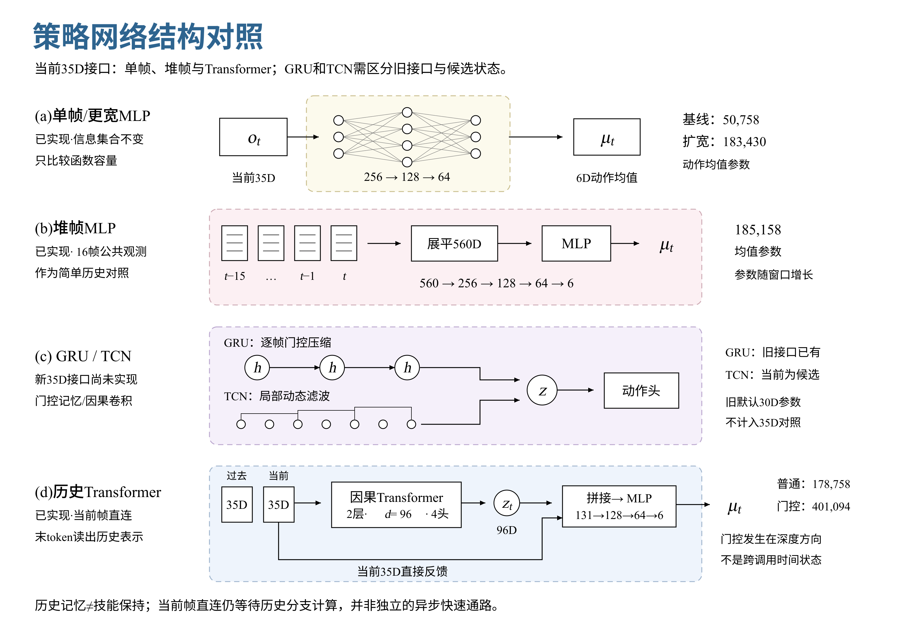
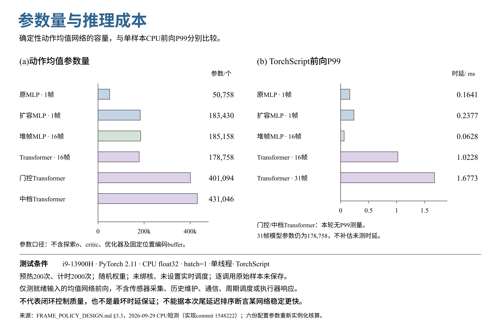

# 强化学习策略网络结构比较

> 2026-09-29 代码审阅快照。本文记录当日已核对的实现、合同与研究方案，不表示实时训练进度。飞书对应文档：[《强化学习会用到的策略网络结构》](https://fa4g5no1b1f.feishu.cn/wiki/XubFwKGT0iJ7wFk3t7ocqg5tnFf)。

## 1 比较口径：信息、结构与训练机制

网络选型要分别回答：当前信息是否足够、历史是否有用、哪种编码方式更合适，以及额外计算是否带来可重复的闭环收益。扩大MLP只改变容量；堆帧改变可用信息；GRU/TCN/attention改变历史处理方式；估计监督和保持损失又是额外训练变量。

| 维度 | 控制变量 | 本轮基线 |
| --- | --- | --- |
| 观测与动作 | 特征语义、噪声、时间、6轴映射 | 35D公共观测；6D原始动作均值 |
| 历史 | 帧数、时间跨度、reset规则 | 50Hz；历史组16帧=0.30s |
| 训练 | 任务/reward/PPO/critic/样本量 | 同一V6合同；81D独立critic |
| 资源 | 参数、MAC、训练显存、目标机时延 | 同时报告，不把参数相近等同成本相近 |

当前35D并非完全没有时间信息：它含上一动作与命令时钟，但没有显式观测窗口。actor不直接读真实机体线速度、高度或接触力。更大的单帧函数也无法保证消除相同观测背后的状态歧义。

配套[《transformer_rl》](https://fa4g5no1b1f.feishu.cn/wiki/MbPrwXYgCi1LErkzNTlczO6Sn7f)详细说明网络、Reward、课程、实时测量和能力保持机制。本篇专注结构差异及公平比较。

## 2 网络家族的特点与适用条件

图1｜从直接映射到历史编码。GRU/TCN行表示编码器候选路线，不能将其标为已接入35D生产训练。

| 结构 | 核心特点 | 适合检验 / 主要代价 | 当前实现边界 |
| --- | --- | --- | --- |
| 单帧MLP | a=f(o_t)，全连接即时映射 | 低计算成本的基准；不额外获得历史 | 35D已实现，V6运行基线同型 |
| 扩容MLP | 扩大隐藏宽度 | 检验容量；信息集合不变 | 35D已实现 |
| 堆帧MLP | 固定时间槽展平拼接 | 简单短时历史；首层参数随L增长 | 35D已实现 |
| GRU / LSTM | 门控压缩时间状态 | 紧凑记忆；窗口内串行，压缩可能丢信息 | GRU仅旧time-aware接口；35D未实现，LSTM候选 |
| TCN | 因果卷积，dilation扩感受野 | 局部动态滤波、共享时间权重；视野由卷积结构决定 | 本仓库35D候选 |
| Transformer | 按内容选择历史，因果attention＋FFN | 可检验自适应历史选择；整窗投影/attention成本较高 | 35D普通小/中档已实现 |
| 门控Transformer | GRU式门替换深度残差相加 | 检验优化稳定性；参数从178.8k增到401.1k | 35D已实现；无Transformer-XL跨片段缓存 |
| 估计器 / 辅助监督 | 历史预测状态/潜变量，再供控制或联合训练 | 提供可诊断学习目标；标签、监督与梯度边界需配对控制 | 旧time-aware接口有实现；35D未接入 |
| 多技能head / adapter | 按请求路由输出或小模块 | 可检验任务干扰；共享encoder仍会漂移 | 35D研究候选 |
| Decision Transformer / ODT | 回报条件化序列策略 | 需额外定义数据与RTG目标协议，训练方法也改变 | 与本轮在线PPO actor替换分开研究 |

**GRU状态管理。** 仓库旧WindowGRU每次从零处理有限窗口，并非无限流式记忆。若改为跨调用状态，训练要保存正确初态、episode reset与序列边界；不能按普通独立样本shuffle后假装同一递归过程。

**门控的含义。** 当前Transformer的GRU式门发生在网络深度方向，不是时间方向GRU；多头attention也不是多技能动作head。门控可以改变优化行为，但没有数学保证阻止旧技能遗忘。

$$
\mathrm{Attention}(Q,K,V)=\mathrm{softmax}\!\left(\frac{QK^\top}{\sqrt{d_h}}+M_{causal}\right)V
$$

每个token是一整帧观测。最后token可读取所有过去帧；固定因果mask只禁止看未来，并不使当前密集实现自动跳过被mask位置的矩阵乘法。

**估计与监督。** 若只有Transformer得到速度/高度等训练标签，就不能把全部收益归于attention；detach只能阻断某条梯度路径，不能保证估计器更新后控制行为不变。DT/ODT也不能仅因使用Transformer就与PPO编码器合并比较。

## 3 已实现配置与实时成本

| 配置 | 结构 | 历史帧 | 动作均值参数 |
| --- | --- | --- | --- |
| mlp | 35→256→128→64→6 | 1 | 50,758 |
| mlp_medium | 35→512→256→128→6 | 1 | 183,430 |
| frame_stack | 560→256→128→64→6 | 16 | 185,158 |
| transformer | d96 × 2层，4头，FFN192；当前帧直连 | 16 | 178,758 |
| transformer_gated | d96 × 2层，GRU式深度残差门 | 16 | 401,094 |
| transformer_medium | d128 × 2层，4头，FFN512 | 16 | 431,046 |

口径：仅确定性动作均值参数，不含6个探索σ、critic、优化器及固定位置编码buffer。完整训练还需对应的外部模块。

图2｜参数容量与单次推理尾部成本分别比较；图中时延是本机短测，不是机器人成功率。

$$
P_{MLP}=\sum_i(n_i+1)n_{i+1},\quad\Delta P_{stack}=(L-1)F n_1
$$

$$
C_{Transformer}\approx LFd+N[L(4d^2+2dm)+2L^2d]+C_{head}
$$

16帧小型Transformer主要MAC为2,536,704，原MLP为50,304；参数约3.52倍，主要乘加约50.4倍，但该比值不是硬件时延比。短窗时投影与FFN也占显著成本。

CPU短测：i9-13900H，PyTorch2.11，单线程，TorchScript，float32、batch=1；预热200次、测2000次，随机权重、未绑核。16帧Transformer P50/P99约0.325/1.023ms；原MLP约0.029/0.164ms。未计传感器、通信、调度或执行生效，不能以P99推断硬实时保证。

| 接口 | 输入与已有能力 | 不可混用之处 |
| --- | --- | --- |
| 新FramePolicy | [B,L,35]；单帧/堆帧/普通与门控Transformer | 仅输出均值；历史缓存、Gaussian、critic和PPO由接入层管理 |
| 旧time-aware | 默认30D帧含sensor ages、known flags、dt；五输入模型；有GRU/估计器/辅助头 | 不能修改proprio_dim凑35D，也不能把旧参数量当本轮35D配置 |

新配置尚不直接适用于旧transformer-rl train/export入口；相邻训练仓库中的TCN、适配器等代码，也不等于本仓库FramePolicy已经支持。

## 4 多轮对照实验设计

| 轮次 | 比较 | 主要回答 |
| --- | --- | --- |
| R0 接口与基线 | 观测/action/reward/时间与reset审计 | 共同链路是否正确 |
| R1 容量 | 50,758 vs 183,430参数单帧MLP | 仅扩大容量有无收益 |
| R2 历史初筛 | 183,430单帧 / 185,158堆帧 / 178,758 Transformer | 历史是否有用，约18万档是否值得上attention |
| R3 严格编码器对照 | 共同encoder→z96，再拼接当前35D进入共同head | MLP/GRU/TCN/Transformer的编码差异 |
| R4 监督 | 同结构开关相同估计标签，再比较encoder | 监督收益与结构收益 |
| R5 扩容与门控 | 178.8k普通 / 431.0k普通 / 401.1k门控 | 门控收益是否超出新增容量解释 |
| R6 保持 | 选定架构配对开关fresh复习/合格teacher约束 | 能力保持来自结构还是训练机制 |
| R7 频率与部署 | 简单网络与Transformer各比较50/100Hz | 更快决策的真实收益与端到端成本 |

R2是实用初筛：当前堆帧MLP直接560→256→128→64→6，而Transformer先编码再与当前帧拼接，两者动作头拓扑不完全相同。R3统一latent维度、直连和动作头后，才更接近严格的编码器因果对照；这些统一接口的35D候选仍需实现。

所有架构使用相同资产、传感器信息、任务分布、奖励、critic、初始σ、评测集与至少3个训练seed。先固定配方初筛，再给候选相同调参预算。相同样本预算与相同训练墙钟是两种不同问题，应分别报告。

| 指标组 | 必须同时记录 |
| --- | --- |
| 行为 | 高度/速度/yaw误差、停车残速、漂移、恢复时间、跌倒、动作振荡/饱和 |
| 保持 | 已验收case丢失、相对固定参考的变化、分技能结果 |
| 训练 | 实际LR/KL、样本量、优化步、吞吐、显存、seed方差 |
| 部署 | 目标设备端到端时延分位数/最大值/超时率、传感器年龄 |

100Hz若保持0.30秒跨度需31帧，每秒主要MAC约为50Hz/16帧的4倍；同时换算折扣、GAE、rollout物理时长与reward时间口径。不能在改变奖励、采样、频率和模型后把收益全归结构。

## 5 选型判据与当前建议

目前值得保留的选择是“小型历史网络＋当前帧直连”的研究方向；是否选择Transformer，要由它相对更简单历史编码器的闭环收益和目标设备成本决定。

| 观察到的证据 | 下一步合理选择 |
| --- | --- |
| 扩容单帧已解决主要误差，历史无稳定收益 | 优先保留单帧MLP的低成本方案 |
| 堆帧明显改善起停/迟滞，attention没有额外收益 | 优先堆帧MLP，同时记录固定窗口局限 |
| 相同信息和head下，attention跨seed改善动态恢复 | 保留小Transformer，再测规模/频率 |
| 速度/高度估计失败主导控制误差 | 配对比较显式估计监督，核对可辨识性 |
| 新旧技能梯度冲突与通过项回退持续出现 | 先比较fresh复习/合格teacher约束，再考虑adapter |
| 目标机尾部时延/数据年龄超预算 | 先优化完整链路或缩小模型，不能只看平均时延 |

当前没有证据表明更大网络一定更好，也没有本轮闭环结果支持“Transformer已经输给MLP”。本次实现证据是网络数值/接口测试和本机推理短测；闭环价值与长期能力保持仍是实验目标。

## 6 版本与参考

当前比较核对于2026-09-29；35D网络实现commit 1548222，实时设计说明7ebe652。参数通过实例化六份配置逐项求和；时延口径详见配套[设计文档](https://fa4g5no1b1f.feishu.cn/wiki/MbPrwXYgCi1LErkzNTlczO6Sn7f)。

- [代码仓库：transformer_rl](https://github.com/Yukikaze2233/transformer_rl)
- [PPO](https://arxiv.org/abs/1707.06347)
- [Attention Is All You Need](https://arxiv.org/abs/1706.03762)
- [GRU：Learning Phrase Representations](https://arxiv.org/abs/1406.1078)
- [TCN：Convolutional and Recurrent Networks for Sequence Modeling](https://arxiv.org/abs/1803.01271)
- [GTrXL：Stabilizing Transformers for Reinforcement Learning](https://proceedings.mlr.press/v119/parisotto20a.html)
- [RMA：Rapid Motor Adaptation](https://arxiv.org/abs/2107.04034)
- [Progressive Neural Networks](https://arxiv.org/abs/1606.04671)
- [Decision Transformer](https://arxiv.org/abs/2106.01345)
