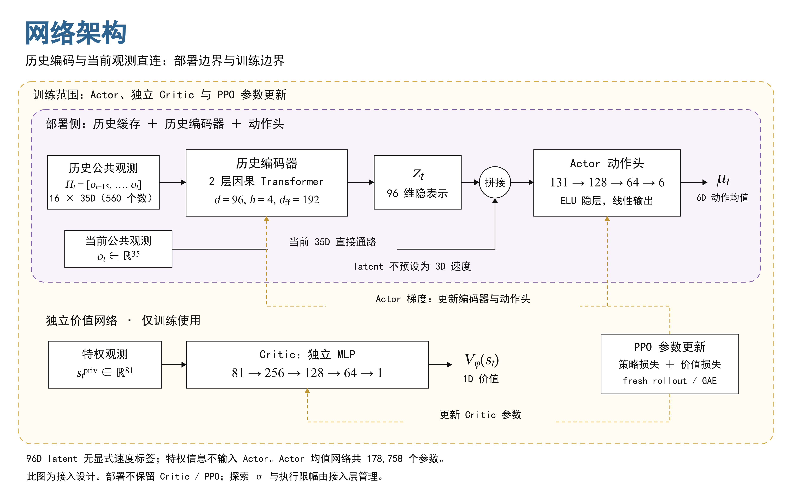
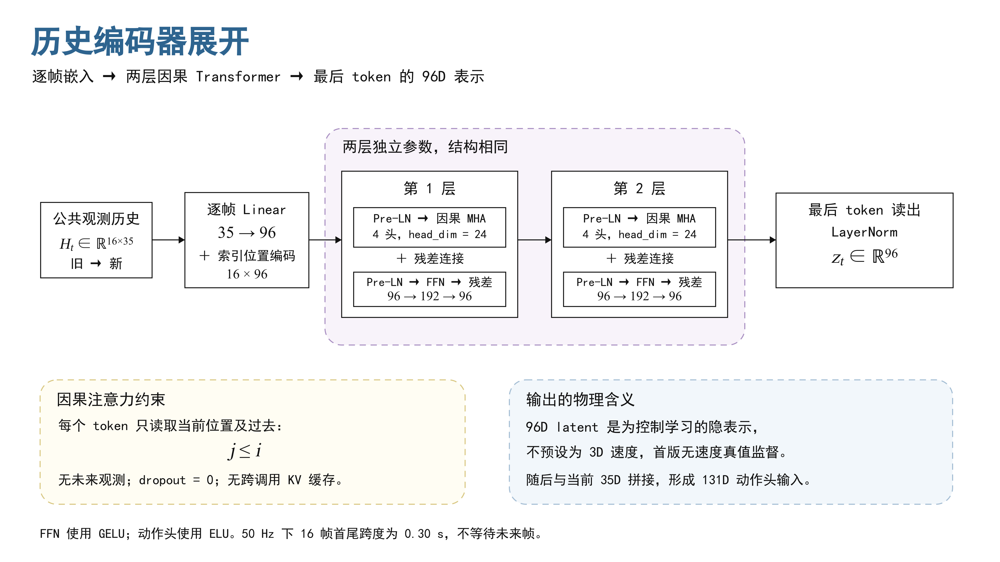
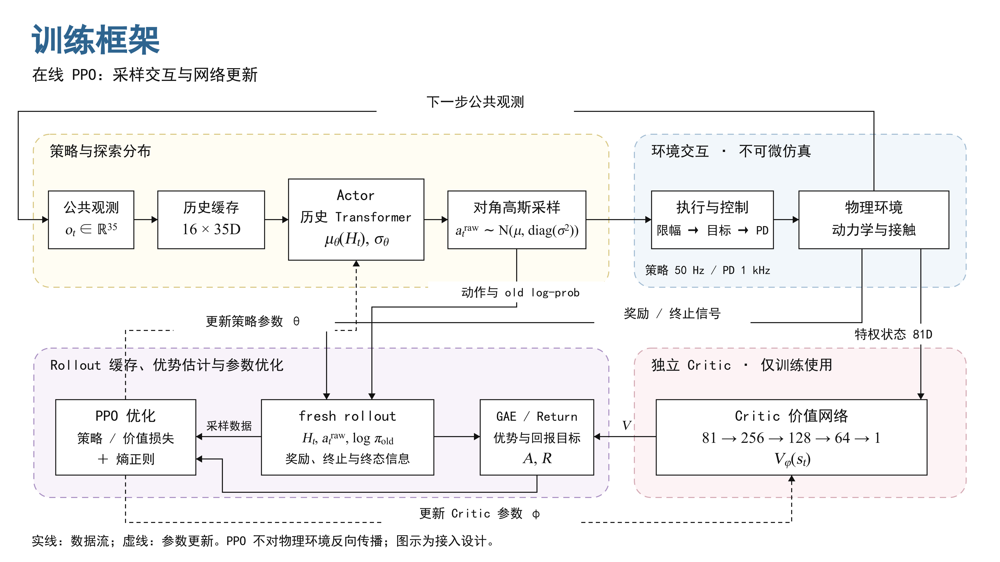
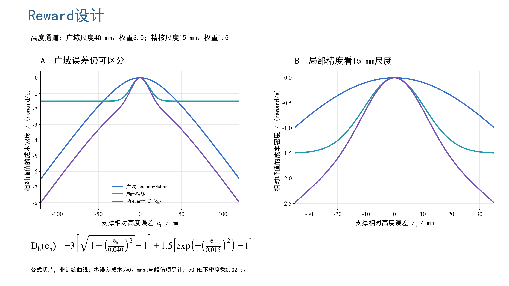
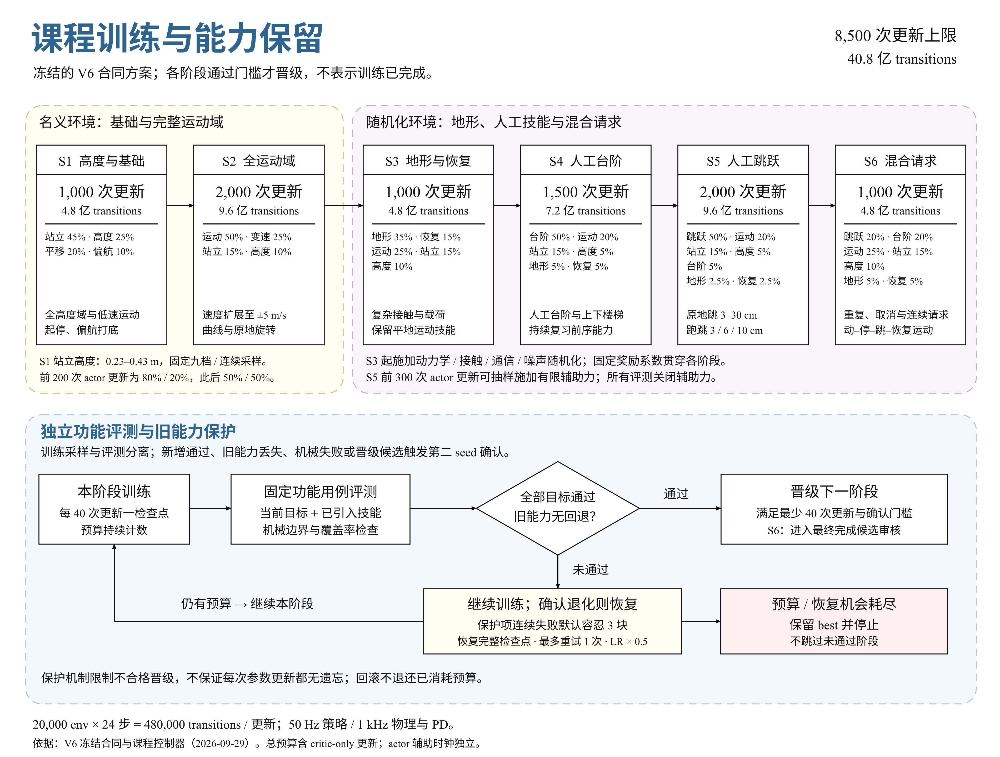

# 策略网络架构、训练与实时接口

> 2026-09-29 代码审阅快照。本文记录当日已核对的实现、合同与研究方案，不表示实时训练进度。飞书对应文档：[《transformer_rl》](https://fa4g5no1b1f.feishu.cn/wiki/MbPrwXYgCi1LErkzNTlczO6Sn7f)。

## 1 网络架构总览：Encoder、Actor与Critic

一帧公共观测为35维，历史窗口取最近16帧。策略由历史编码器与动作头共同构成Actor；Critic在训练期读取81维特权状态，输出一个价值标量。部署保留历史缓存、编码器和动作头。

$$
o_t=[c_t^{(4)},\omega_t^{(3)},g_t^{(3)},\Delta q_t^{(6)},\dot q_t^{(6)},a_{t-1}^{(6)},m_t^{(7)}]\in\mathbb R^{35}
$$

构成为：命令4维＋机体角速度3维＋投影重力3维＋六轴相对角度6维＋六轴速度6维＋上一动作6维＋请求上下文7维。两个轮位置槽为0；缩放和轴顺序由35D观测合同确定。

*图1｜网络架构总览。上半部分为部署Actor，下半部分为训练期Critic与参数更新；所有维度对应当前35D方案。*

$$
H_t=[o_{t-15},\ldots,o_t]\in\mathbb R^{16\times35},\quad z_t=E_\theta(H_t)\in\mathbb R^{96}
$$

$$
\mu_t=\pi_\theta([o_t,z_t])\in\mathbb R^6,\qquad V_\phi(s_t)\in\mathbb R
$$

96维latent是由PPO目标学习的历史表示，未指定为三维速度，也没有在本轮增加速度估计监督。它可能编码响应趋势、执行迟滞等线索；能否改善控制要通过对照验证。

| 模块 | 输入 → 输出 | 用途 |
| --- | --- | --- |
| 历史编码器 | 16×35 → 96 | 提取最近0.30秒的动态上下文 |
| Actor动作头 | 当前35＋历史96 = 131 → 6 | 产生四腿位置偏置与两轮速度目标所用的原始均值 |
| Critic | 81 → 1 | 训练期估计价值，参与GAE/PPO；部署不携带 |

该图沿用“历史编码器＋当前帧直连＋独立Critic”的表达方式，维度与内部结构采用本项目实现；不是将参考图中的25/125/3/144维直接套用到当前模型。

## 2 历史编码器与Actor：逐层尺寸

编码器按时间处理整帧token；560只是窗口内标量总数，不是在进入Transformer前展平成单个token。下面用B表示batch大小。

| 步骤 | 运算 | 张量尺寸 |
| --- | --- | --- |
| 历史输入 | 最近16帧，旧→新 | [B,16,35] |
| 逐帧投影 | Linear(35,96)＋固定位置编码 | [B,16,96] |
| 两层编码 | Pre-LN因果MHA＋FFN；4头，每头24维 | [B,16,96] |
| 历史读出 | 最终LayerNorm，取最后token | [B,96] |
| 融合 | 拼接当前35维与历史96维 | [B,131] |
| 动作头 | Linear128＋ELU → Linear64＋ELU → Linear6 | [B,6] |

*图2｜历史编码器展开。每层先归一化再计算注意力/FFN，最后token读取全部过去帧。*

$$
H_t=[o_{t-15},\ldots,o_t],\quad X^0=H_tW_e^\top+\mathbf1b_e^\top+P
$$

$$
U^\ell=X^\ell+\mathrm{MHA}_{causal}(\mathrm{LN}(X^\ell)),\quad X^{\ell+1}=U^\ell+\mathrm{FFN}(\mathrm{LN}(U^\ell))
$$

$$
z_t=\mathrm{LN}(X^2)_t,\quad\mu_t=\mathrm{MLP}_{131\to128\to64\to6}([o_t,z_t])
$$

每个token是一整帧35D。d_model=96、head_dim=24、FFN=192，FFN使用GELU，动作头使用ELU，输出层为线性；零dropout、固定索引位置编码、完整窗口重算，无跨调用KV cache。

| 35D槽位（从0开始） | 含义 |
| --- | --- |
| 0–3 | vx/vy/yaw命令，高度命令×5 |
| 4–9 | IMU角速度×0.5、投影重力 |
| 10–21 | 六轴相对角度与速度；两个轮位置槽为0；速度×0.1 |
| 22–27 | 上一条经过执行限幅的动作，按policy轴序 |
| 28–34 | normal/stair/保留slope/recover/jump请求、请求高度幅值、命令参考时钟 |

原MLP均值网络为35→256→128→64→6，共50,758参数；当前Transformer为178,758参数。高斯探索另有6个状态无关标准差参数，初始σ=1.0；critic保持81→256→128→64→1，共62,209参数。Actor与critic不共享特征。

$$
a_t^{raw}\sim\mathcal N(\mu_t,\mathrm{diag}(\sigma^2))
$$

PPO记录原始动作及log-prob；执行层再把腿动作限到±3、轮动作限到±9。腿目标为nominal＋0.25a，轮速目标为10a。网络不加tanh，也不重复缩放已经按观测合同处理的输入。历史reset由接入层重复首帧，同一tick不重复推进，rollout保存独立快照。

当前帧直连为动作头保留未经历史压缩的观测，但仍须等待历史分支计算完成。完整actor是encoder与动作头的组合；历史缓存留在调用层，不能只导出动作头后称为同一个策略。

## 3 Critic与PPO：训练和部署的边界

Actor与Critic是独立网络。Critic的81维输入由干净35D公共观测、真实机体线速度3、实际高度1、轮接触力2、机构位置18、机构速度18、摩擦2、地形高度2组成；这46维额外信息不会直接传入部署Actor。

$$
V_\phi(s_t)=\mathrm{MLP}_{81\to256\to128\to64\to1}(s_t)
$$

PPO策略损失通过动作均值回传到Actor动作头与历史编码器；价值损失更新独立Critic。Critic通过优势估计影响策略学习，但不是将81维特权向量拼进Actor输入。部署时只需Actor推理及完整观测/执行链。

图3｜rollout采样与PPO更新交替进行。图中的仿真器产生转移和reward，策略梯度由log-prob、优势与PPO目标计算；本方案不采用参考截图中的可微仿真预训练。

$$
\rho_t(\theta)=\frac{\pi_\theta(a_t^{raw}|H_t)}{\pi_{old}(a_t^{raw}|H_t)}
$$

$$
L_{clip}=-\mathbb E[\min(\rho_t\hat A_t,\mathrm{clip}(\rho_t,1-\epsilon,1+\epsilon)\hat A_t)]
$$

$$
\delta_t=r_t+\gamma V(s_{t+1})-V(s_t),\qquad\hat A_t=\sum_{l\ge0}(\gamma\lambda)^l\delta_{t+l}
$$

GAE按episode边界截断；终止与时间截断的bootstrap语义按环境合同处理。训练用81D特权状态降低价值估计难度，部署只携带actor所需的公共观测链。

| 当前V6配置 | 数值/口径 |
| --- | --- |
| 并行环境 / rollout | 20,000 × 24步 = 480,000 transitions |
| 策略 / 物理与PD | 50Hz / 1kHz |
| PPO更新 | 5 epochs × 10 minibatches = 每rollout 50次optimizer step |
| γ / λ / clip | 0.99 / 0.95 / 0.2 |
| 学习率 / KL目标 | 初始1e-4，adaptive；目标KL=0.01 |
| entropy / grad norm | 0.005 / 1.0 |
| value loss系数 | 通常4.0；terrain/mixed入口为2.0 |

当前adaptive LR会变化，不能将初始1e-4写成恒定学习率。Transformer首轮保留同一训练器、critic和样本预算；新的均值网络尚需薄适配层、完整checkpoint身份与独立研究合同。

## 4 接口与实时控制

16帧保存的是已经发生的过去，不会额外等待0.30秒；动作头只需等待本次前向完成。底层1kHz PD继续负责快速反馈。历史有潜在控制价值，实时可部署性则取决于目标设备的完整链路。

| 网络（CPU/TorchScript/batch=1） | P50 ms | P99 ms | 观测最大 ms |
| --- | --- | --- | --- |
| 单帧MLP | 0.0294 | 0.1641 | 0.4285 |
| 16帧堆帧MLP | 0.0341 | 0.0628 | 0.0760 |
| 16帧Transformer | 0.3248 | 1.0228 | 1.5041 |
| 31帧Transformer | 0.4344 | 1.6773 | 2.0305 |

测量日期2026-09-29；本机i9-13900H，PyTorch2.11、float32、单线程、随机权重，预热200次后测2000次。未绑核、未设实时调度，未包含采集、通信、缓存维护或执行生效；有限短测不是目标机最坏时延保证，也不代表训练后控制质量。

$$
T_{infer}=t_{finish}-t_{start},\quad T_{cycle}=t_{apply}-r_k,\quad A_g=t_{apply}-t_{sample,g}
$$

分别记录推理耗时、从预定周期开始到动作生效的时延、各传感组在执行时的数据年龄。超时按全部预定周期统计，未产生/丢失的动作也计入；只测到发送时刻就报告发送时延，不冒充执行生效。物理恢复时间另按扰动事件与恢复判据测量。

| 频率与窗口 | 首尾跨度 | 主要MAC/动作 | 主要MAC/秒 |
| --- | --- | --- | --- |
| 50Hz，16帧 | 0.30s | 2,536,704 | 126,835,200 |
| 100Hz，16帧 | 0.15s | 2,536,704 | 253,670,400 |
| 100Hz，31帧 | 0.30s | 5,069,664 | 506,966,400 |

保持0.30秒历史再升频，每秒主要计算约增至4倍。当前索引位置编码没有显式dt/数据年龄，不能直接把50Hz权重提频部署。

$$
\gamma_{100}=\sqrt{\gamma_{50}},\quad\lambda_{100}=\sqrt{\lambda_{50}}
$$

上述换算保持连续时间折扣与GAE衰减时标；rollout由24改48步才保持0.48秒。按时间积分的reward核对dt，一次性事件罚分按事件计，动作变化惩罚与执行迟滞也要复核。先验证50Hz架构收益，再研究100Hz。

## 5 已实现配置与对照方式

网络选型采用逐层增加变量的实验顺序，详细比较见[《强化学习会用到的策略网络结构》](https://fa4g5no1b1f.feishu.cn/wiki/XubFwKGT0iJ7wFk3t7ocqg5tnFf)。每轮至少3个独立训练seed，同时报告分项行为、推理尾部时延、训练吞吐与显存；参数接近不等于算力或训练难度相同。

| 轮次 | 对照与目的 |
| --- | --- |
| 容量 | 50.8k单帧MLP vs 183.4k单帧MLP |
| 历史初筛 | 183.4k单帧 / 185.2k堆帧 / 178.8k Transformer |
| 编码器严格对照 | 统一latent维度、当前帧直连和动作头，再比较MLP/GRU/TCN/attention |
| 监督与保持 | 在相同结构上配对开关监督估计/复习/合格teacher约束 |
| 扩容与门控 | 普通178.8k、普通431.0k、门控401.1k，分辨新增容量的作用 |
| 频率 | 胜出的简单网络和Transformer各做50/100Hz对照 |

已实现：六个35D配置、确定性均值核心、60项专项测试；实现提交的全仓库结果1194通过、14项历史checkpoint审计按条件跳过。待完成：生产PPO接入、完整学习状态恢复与导出身份、保持损失、目标设备时延与机器人闭环实验。

## 附录 A Reward设计

本节描述已核对的新资产V6奖励。它由跟踪密度、姿态/平滑/能耗成本、跳跃相位奖励、路程增量和单次事件组成；Transformer首轮对照沿用同一份reward，避免同时改结构和目标。

$$
r_t=\Delta t\,[d_{base,t}+d_{jump,t}+d_{margin,t}]+\mathbf1_{route}\,\mathrm{clip}(x_t-x_{t-1},-0.02,0.02)+5\mathbf1_{success}-200\mathbf1_{terminated}
$$

50Hz下Δt=0.02s。base/jump密度各乘一次dt；route项已经是位移增量，直接相加；成功+5和失败终止−200按单次事件计。时间截断不等于失败终止。当前margin密度权重为0，机械膝范围、气簧行程和闭链约束仍有硬终止。

### A.1 广域成本与局部精度

$$
\rho(z)=\sqrt{1+z^2}-1,\qquad D_i(e)=-w_{b,i}\rho(e/s_{b,i})+w_{f,i}[e^{-(e/s_{f,i})^2}-1]
$$

广域项让大误差仍有区分；局部精核在小误差范围增加分辨率。D在零误差为0，是相对峰值的负成本；理想跟踪峰值另按任务mask加入。它的解析斜率不是PPO对参数的梯度，两者在零误差处导数也为0。

*图4｜高度通道 $D(e)$ 的广域成本、局部精核与总成本切片；曲线的解析斜率不是 PPO 对策略参数的梯度。*

| 通道 / 单位 | 广域尺度 s_b | 广域权重 w_b | 精核尺度 s_f | 精核权重 w_f |
| --- | --- | --- | --- | --- |
| 高度 / m | 0.040 | 3.0 | 0.015 | 1.50 |
| 前向速度 / m/s | 0.50 | 2.0 | 0.10 | 0.60 |
| 侧向速度 / m/s | 0.15 | 0.50 | 0.08 | 0.25 |
| yaw速度 / rad/s | 1.0 | 1.0 | 0.20 | 0.35 |
| 静止平面速度误差 / m/s | 0.10 | 1.50 | 0.04 | 0.75 |

权重单位为reward/s。高度为base_link到双轮支撑面的高度；普通前向速度使用机体系vx的水平投影，yaw按命令误差计算。真实base线速度与实际支撑相对高度不直接加入actor；IMU角速度与电机速度仍是actor可观测量。

$$
q=O(1-J)\,\mathrm{clip}\!\left(1-\max\!\left(\frac{|c_v|}{0.10},\frac{|c_\omega|}{0.20}\right),0,1\right)
$$

O表示普通非自旋平移，J为jump请求，S为代码的support_tracking掩码。高度成本用S(1−J)，前向/侧向用O(1−q)，静止成本用qS，yaw持续生效；自旋平移另有参考坐标速度误差路径。负跟踪成本不因姿态倾斜而减免。

### A.2 平滑、姿态、能耗与几何约束

| 分项 | 每秒密度或口径 |
| --- | --- |
| 六轴力矩 / 轮正功率 | −1e−4 Στ²；−1e−4 Σ轮 max(τq̇,0) |
| 腿 / 轮速度 | −0.005 Σ腿 q̇²；−1e−5 Σ轮 q̇² |
| 腿 / 轮加速度 | −5e−7 Σ腿 q̈²；−1e−8 Σ轮 q̈² |
| 动作率 | −0.01 Σ(a_t−a_{t−1})² |
| 二阶动作平滑 | 腿−0.05、轮−0.01，分别乘Σ(Δ²a)² |
| 机体水平角速度 | −0.05(ωx²+ωy²) |
| 姿态 | roll/pitch精度奖励与偏差成本；台阶有可见请求时钟驱动的pitch参考 |
| 两轮前后错位 f | −1[\|f\|>0.05] − (5f)² |
| 非期望接触 | −2；严重机械条件另触发终止 |

命令PUSH阶段仅对力矩、轮功率、动作率及腿/轮二阶平滑这5项乘0.25；其他项并非统一打折。当前dense路径替代旧precision_tracking同义项，不能叠加旧精度字段重复计算；本轮StationaryAnchor世界位置锚点未启用。

### A.3 跳跃奖励围绕真实起跳与恢复

命令参考经历PRELOAD→PUSH→弹道参考→LAND→RECOVER；真实支持/FLIGHT由物理状态判定。命令走到飞行时段，不代表机器人已经离地。

$$
v_r=\sqrt{2gH},\quad e_H=\Delta h_{COM}-\Delta h_{ref},\quad e_V=v_{COM,z}-v_{ref,z}
$$

$$
K_H=e^{-(e_H/0.035)^2},\quad K_V=e^{-(e_V/0.5)^2}
$$

$$
\mathrm{shortfall}=\mathrm{clip}\!\left(\frac{v_r-v_{COM,z}}{\max(v_r,0.3)},0,2\right)
$$

| 相位 | 主要过程奖励 / 成本 |
| --- | --- |
| PRELOAD | 高度 3K_H−\|e_H\|；速度 1.5K_V−0.25\|e_V\| |
| PUSH | 高度1.5K_H；速度4K_V−shortfall；释放速度匹配 |
| 真实FLIGHT | 收腿、姿态、双轮居中与低轮力矩 |
| LAND | COM高度、竖直/平面速度、姿态与落地冲击 |
| RECOVER | base高度恢复；静止跳还约束落点漂移 |

落地相关收益要求真实离地至少0.06s，并乘min(1,COM上升高度/H)，抑制极小蹦跳解锁完整落地收益。最终验收仍检查有效离地、目标高度、真实接触、稳定和协议；过程reward上涨不能代替成功。普通换高不追踪不可见的隐藏ḣ/加速度目标。

## 附录 B 课程与能力保持

图5｜阶段预算是上限，不是已完成进度。每阶段通过即可提前结束；未通过不跳阶段。每次rollout含480,000条转移，8500更新上限对应40.8亿转移，包含critic-only更新消费。

| 阶段 | 能力范围 | 更新上限 | 行为池配额 |
| --- | --- | --- | --- |
| S1 | 全高度、静止、换高、±0.5m/s、启停、±1rad/s yaw | 1000 | 静止45% / 高度25% / 平移20% / yaw10% |
| S2 | ±0.5/1/2/3/4/5m/s、过渡、曲线、自旋 | 2000 | 运动50% / 过渡25% / 静止15% / 高度10% |
| S3 | 地形、材质、载荷、扰动与落地恢复 | 1000 | 地形35% / 恢复15% / 运动25% / 静止15% / 高度10% |
| S4 | 人工请求台阶与上下楼梯 | 1500 | 台阶50% / 运动20% / 静止15% / 高度5% / 地形5% / 恢复5% |
| S5 | 3–30cm静止跳；3/6/10cm行进跳 | 2000 | 跳跃50% / 运动20% / 静止15% / 高度5% / 台阶5% / 地形2.5% / 恢复2.5% |
| S6 | 混合任务、repeat/cancel、连续跳与动作序列 | 1000 | 跳跃20% / 台阶20% / 运动25% / 静止15% / 高度10% / 地形5% / 恢复5% |

S1静止高度覆盖0.23–0.43m：前200次actor更新80%固定九档＋20%连续，随后50%＋50%。同一阶段名称不代表采样分布不变。S1/S2不启用robust随机化；S3起加入动力学/接触/噪声和扰动。本合同max_delay_steps=0，不能把噪声模块写成已施加20ms感知延迟。

### B.1 有限辅助与独立验收

$$
p(u)=0.8-0.6u/300,\quad\alpha(u)=1-u/300,\quad 0\le u<300
$$

仅S5前300次actor更新可抽样施加world-up辅助，超过窗口或评测时硬关；只在PUSH且真实支持时施加。力上限0.35mgα、冲量上限0.25m√(2gH)、时长上限0.12s。辅助/无辅助成功分开统计；它是训练条件，不是电机能力，也不是reward。

每40更新固定评测；达到候选晋级、新通过、回退或机械失败等条件后追加第二seed确认。晋级集合累计包含已引入能力，新通过且双seed确认的项目进入retention ledger。跨阶段迁移actor/critic并重建optimizer；同合同resume恢复完整学习状态。回滚次数与预算有界，消费不返还。

| 通用评测项 | 合同门槛（case可覆盖） |
| --- | --- |
| 生存 / 成功 | ≥0.95 |
| 高度MAE | ≤0.01m |
| 前向速度 / yaw MAE | ≤0.10m/s / ≤0.15rad/s |
| 站立漂移 / 站立vx MAE | ≤0.10m / ≤0.03m/s |
| 倾角 / 机械gap | ≤20° / ≤0.003m，并无机械终止 |

跳跃case按专用跳跃成功判据处理，不能把全程强行当作静止高度跟踪。短历史网络也不能替代busy repeat、空中cancel与恢复后重新接收请求的显式状态机。

### B.2 抗遗忘研究臂：与架构分开

$$
\Delta L_{old}\approx-\eta g_{old}^{\top}g_{new}
$$

负梯度内积意味着新任务更新可能增加旧损失；attention并不约束这一内积。保留现有复习与晋级门控后，研究按技能分层的fresh采样，以及只在已验收区域启用的teacher行为约束。

$$
L=L_{PPO}+c_VL_V-c_H\mathcal H+\lambda_{keep}\,\mathbb E[q(H)D_{KL}(\pi^*(\cdot|H)\Vert\pi_\theta(\cdot|H))]
$$

此保持损失尚未接入。旧历史/teacher输出可用于监督；旧动作、GAE、value target不能直接作为当前PPO样本。训练锚点与最终留出评测分离，未验收能力不作为强teacher，MLP与Transformer获得相同保持训练条件。

## 版本、证据与参考

本次设计以已核对的V6新资产合同、冻结运行源码和独立网络仓库为依据。运行状态只引用2026-09-29历史快照；不会用文档更新暗示当前进度。

| 来源 | 版本/定位 |
| --- | --- |
| 网络实现 | transformer_rl：1548222；实时设计说明：7ebe652 |
| 运行冻结源码 | 1f9a884368e772741c269567a1b4b3c21f371349 |
| 任务与预算 | v6_new_asset_training_v1.json / v6_new_asset_budget_v1.json |
| 主要实现定位 | frame_policy.py；train_chassis.py；rewards.py；training_schedule.py；full_curriculum.py |

[网络仓库](https://github.com/Yukikaze2233/transformer_rl) · [配套网络比较文档](https://fa4g5no1b1f.feishu.cn/wiki/XubFwKGT0iJ7wFk3t7ocqg5tnFf)

- [PPO：策略优化目标](https://arxiv.org/abs/1707.06347)
- [GTrXL：强化学习中的Transformer优化](https://proceedings.mlr.press/v119/parisotto20a.html)
- [RMA：实时运动适应](https://arxiv.org/abs/2107.04034)
- [Policy Distillation：策略蒸馏](https://arxiv.org/abs/1511.06295)
